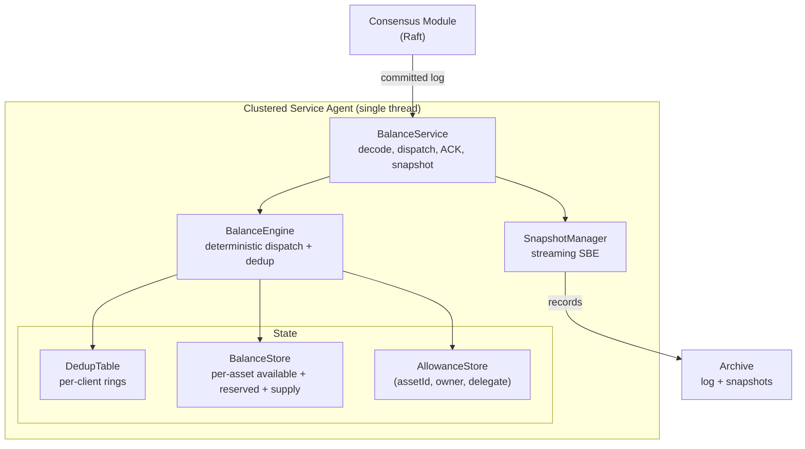

# LEDGERD - Aeron Distributed Balance Engine

[](https://github.com/justrade/ledgerd/actions/workflows/ci.yml)
[](LICENSE)

A deterministic, replicated, in-memory balance and delegated-spending engine in
Java, built on Aeron Cluster. Strong consistency and ultra-low latency for a
core ledger: the single source of truth for balances and allowances.

## Overview

LEDGERD Core is a strongly consistent balance processing engine for low-latency,
high-throughput workloads. It runs as a single Aeron `ClusteredService`
replicated by Raft, and does exactly one thing well: execute deterministic state
transitions on balance and allowance state. Every command is idempotent, every
result is byte-reproducible across nodes, and the hot path is allocation-free.

It targets the same class of problems as deterministic ledgers and replicated
state machines: financial cores, event-sourced systems, and any service where a
double-applied command or a nondeterministic replay is a correctness failure.

## Features

- **Deterministic**: identical input logs produce byte-identical state and
  snapshots across nodes and reruns.
- **Idempotent**: a per-client dedup window guarantees every command is applied
  at most once, even across Edge retries and failover.
- **Allocation-Free Hot Path**: zero heap allocation during decode, dispatch,
  and ACK in steady state.
- **Lock-Free Single-Writer**: one clustered-service thread owns all state; no
  locks, no atomics, no contention.
- **Crash Tolerant**: state is recoverable from the replicated log; controlled
  snapshots include the dedup table so idempotency survives recovery.
- **Overflow-Safe**: 64-bit fixed-scale amounts with checked arithmetic; overflow
  returns a status code, never a silent wrap-around.
- **Multi-Asset**: balances, allowances, and total supply are isolated per asset
  via a composite `(assetId, accountId)` key; a single-asset deployment simply
  uses asset `0` (ADR 0009).
- **Two-Phase Holds**: `RESERVE` / `CAPTURE` / `RELEASE` split each balance into
  `available` and `reserved` buckets for escrow, authorization, and settlement
  flows, with total supply conserved (ADR 0010).
- **SBE Wire Format**: fixed binary layout, no reflection, backward-compatible
  schema evolution via optional fields.
- **Fault-Tolerant Failover**: multi-node Raft cluster with leader election and
  catch-up recovery; in-flight commands are retried idempotently across leader
  changes with no double-apply.
- **Edge Client SDK**: `write-client` adds leader-change handling, idempotent
  retry, asynchronous result correlation, explicit backpressure signalling, and
  end-to-end HdrHistogram latency, consuming only the wire contract.
- **CQRS Read Side**: `read` serves eventually-consistent balance, allowance,
  and total-supply reads over a plain Aeron query protocol (`QueryRequest` /
  `QueryResponse`). A read replica node follows a cluster member's Aeron Archive
  (no quorum impact, sub-second live log following) and fails over across every
  member's Archive with no leader discovery (ADR 0006, 0008).
- **Read Client SDK**: `read-client` queries a read replica over Aeron
  request/response streams with request-id correlation, idempotent retry, and
  typed results, consuming only the wire contract.
- **Domain Event Journal**: an opt-in, deterministic stream of semantic facts
  (balance changed, transfer, allowance changed, reservation, rejection) is
  emitted off the consensus hot path and recorded per member, giving downstream
  consumers a decoupled fan-out substrate without re-implementing the engine
  (ADR 0011).
- **Off-Heap Telemetry**: core counters are mirrored to a standalone off-heap
  `CountersManager` so operators can read them from another thread without
  perturbing the single-writer hot path.

> Requires JDK 21 and Linux. Aeron/Agrona need the JVM flags
> `--add-opens java.base/jdk.internal.misc=ALL-UNNAMED` and
> `--add-opens java.base/sun.nio.ch=ALL-UNNAMED`.

## Installation

LEDGERD is a Gradle multi-module project. Build it from source:

```bash
git clone <repo-url> ledgerd && cd ledgerd
./gradlew build
```

To embed the engine in another Gradle build, depend on the core module (or on
`write-client` for the Edge-side SDK):

```kotlin
dependencies {
    implementation(project(":core"))    // deterministic engine
    implementation(project(":write-client"))  // Edge-side client SDK
}
```

## Quick Start

The fastest way to see the engine work end to end is the runnable example. It
boots an in-process single-node cluster, connects an `WriteClient`, submits a
credit and a transfer, and prints the resulting balances:

```bash
./gradlew :examples:run
```

Run a single-node cluster:

```bash
./gradlew :launcher:run
```

Run a specific node of a multi-node cluster, or load a deployment from a
properties file:

```bash
# node 1 of a localhost cluster, preserving prior state across restarts
./gradlew :launcher:run -Dledgerd.nodeId=1 -Dledgerd.cleanStart=false

# from a properties file (must define ledgerd.clusterMembers)
./gradlew :launcher:run --args="--config=production.properties"
```

Drive the deterministic engine directly (no cluster required), which is exactly
how the unit tests exercise it:

```java
import io.justrade.ledgerd.config.CoreConfig;
import io.justrade.ledgerd.core.BalanceEngine;
import io.justrade.ledgerd.core.CommandOutcome;
import io.justrade.ledgerd.protocol.*;
import io.justrade.ledgerd.telemetry.CoreMetrics;
import org.agrona.concurrent.UnsafeBuffer;

// Build an engine with preallocated, power-of-two capacities.
BalanceEngine engine = new BalanceEngine(CoreConfig.defaults(), new CoreMetrics());
CommandOutcome outcome = new CommandOutcome();

// Encode a CREDIT command with an SBE flyweight (reused, allocation-free).
UnsafeBuffer buffer = new UnsafeBuffer(new byte[256]);
MessageHeaderEncoder header = new MessageHeaderEncoder();
new CommandEnvelopeEncoder()
    .wrapAndApplyHeader(buffer, 0, header)
    .clientId(1).clientSeq(0).commandIdHi(0).commandIdLo(42)
    .commandType(CommandType.CREDIT)
    .accountA(100).accountB(0).amount(500)
    .correlationId(CommandEnvelopeEncoder.correlationIdNullValue())
    .accountC(0)
    .assetId(0);

// Wrap a decoder at the message body and process the command.
MessageHeaderDecoder headerDecoder = new MessageHeaderDecoder();
CommandEnvelopeDecoder command = new CommandEnvelopeDecoder();
headerDecoder.wrap(buffer, 0);
command.wrap(buffer, MessageHeaderDecoder.ENCODED_LENGTH,
    headerDecoder.blockLength(), headerDecoder.version());

boolean duplicate = engine.process(command, outcome);
System.out.println(outcome.status());        // SUCCESS
System.out.println(outcome.resultBalance());  // 500
System.out.println(duplicate);                // false
```

Resubmitting the same `clientId` and `clientSeq` returns the cached result and
does not re-apply the command (`duplicate == true`).

### Using the client SDK

`write-client` is the Edge-side SDK. It depends only on the wire contract (never on
`core`) and handles leader changes, idempotent retries, and result
correlation for you:

```java
import io.justrade.ledgerd.write.client.WriteClient;
import io.justrade.ledgerd.write.client.config.ClientConfig;
import io.justrade.ledgerd.launcher.ClusterConfig;
import io.justrade.ledgerd.protocol.CommandType;

ClientConfig config = ClientConfig.builder(1L, ClusterConfig.ingressEndpoints(1)).build();
try (WriteClient client = new WriteClient(config,
        (idHi, idLo, status, balance, hasBalance, allowance, hasAllowance) ->
            System.out.println(status + " balance=" + balance))) {

    client.submit(CommandType.CREDIT, 100, 0, 0, 500);
    while (client.pendingCount() > 0) {
        client.poll(); // drives egress delivery and idempotent retransmission
    }
}
```

## How It Works

LEDGERD Core is a replicated state machine. Commands flow through Aeron Cluster and
arrive at `BalanceService` in total order on a single thread:

1. **Dispatch**: `onSessionMessage` decodes the SBE envelope. The dedup table is
   checked first; a hit returns the cached result verbatim. A miss dispatches to
   a handler (credit, debit, transfer, approve, delegated transfer, reserve,
   capture, release).
2. **Idempotency**: because `clientSeq` is monotonic per client, its dedup slot
   is `seq & (capacity - 1)`, so lookup and store are O(1) and allocation-free.
3. **ACK**: the result is encoded as an SBE `CommandResult` carrying the original
   `commandId` and offered to egress, with back-pressure handled by idling.
4. **Snapshot and Recovery**: on a controlled trigger, state is streamed to the
   Archive in deterministic key order (including the dedup table). On restart,
   the snapshot is loaded and the remaining log is replayed.

The business logic lives in `BalanceEngine`, which has no Aeron dependency and is
therefore unit and replay testable in isolation.

## Configuration

Capacities are preallocated, power-of-two, and validated in `CoreConfig`:

```java
public static final int DEFAULT_ACCOUNT_CAPACITY         = 1 << 20; // balance slots
public static final int DEFAULT_ALLOWANCE_OWNER_CAPACITY  = 1 << 16; // allowance owners
public static final int DEFAULT_DELEGATE_CAPACITY         = 1 << 4;  // delegates per owner
public static final int DEFAULT_DEDUP_CLIENT_CAPACITY     = 1 << 16; // dedup clients
public static final int DEFAULT_DEDUP_WINDOW              = 1 << 10; // commands retained per client
```

Node endpoints and directories are described by `ClusterConfig`: `singleNodeLocalhost`
for local runs and integration tests, `multiNodeLocalhost` for an in-process
multi-node cluster, and `fromProperties` to load a node from a deployment
properties file (`ledgerd.clusterMembers`, `ledgerd.baseDir`, `ledgerd.host`).

### Observability

The launcher can expose the off-heap counters over HTTP in Prometheus text format
for SRE scraping, enabled with a system property:

```bash
./gradlew :launcher:run -Dledgerd.metricsPort=9100
curl http://localhost:9100/metrics   # ledgerd_commands_processed, ledgerd_duplicates_detected, ...
curl http://localhost:9100/healthz   # ok
```

The export includes counters (commands processed, duplicates, backpressure,
leader elections, error statuses) and gauges (snapshot write/read time in
nanoseconds, balance / allowance-owner / dedup-client map sizes). The endpoint
runs on its own daemon thread and only reads counter values, never touching the
single-writer hot path.

## Architecture



| Module          | Responsibility                                                        |
|-----------------|-----------------------------------------------------------------------|
| `protocol` | SBE schema and generated flyweight codecs (wire, snapshot, event journal, read query) |
| `core`     | Deterministic engine, handlers, dedup, snapshot, event journal ring, telemetry |
| `launcher` | Aeron bootstrap: Media Driver, Archive, Consensus Module, Container, event journaler |
| `write-client`   | Edge-side SDK: leader-change handling, idempotent retry, correlation  |
| `read`     | CQRS read side: read replica node (Archive replication + failover), Aeron query responder, event journal follower |
| `read-client`   | Read-side SDK: Aeron request/response queries, correlation, typed results |
| `tests`    | Unit, property, integration, cluster, fault, soak tests and fixtures  |
| `examples` | Runnable examples (QuickStart, RemoteClient)                          |

Within `core`:

| Component         | Responsibility                                                    |
|-------------------|-------------------------------------------------------------------|
| `BalanceEngine`   | Idempotent dispatch over balance and allowance state              |
| `BalanceService`  | ClusteredService callbacks: decode, apply, ACK, snapshot          |
| `BalanceStore`    | Primitive balance map plus the total-supply invariant             |
| `AllowanceStore`  | Nested primitive map keyed by (assetId, owner, delegate)          |
| `DedupTable`      | Per-client rings, O(1) idempotency within the dedup window        |
| `SnapshotManager` | Deterministic streaming snapshot write and load                   |
| `CoreMetrics`     | Single-writer observability counters                              |

| Document | Covers |
|---|---|
| [docs/ARCHITECTURE.md](docs/ARCHITECTURE.md) | Component map, wire format, data flows, determinism rules |
| [docs/API-REFERENCE.md](docs/API-REFERENCE.md) | Client SDK, commands, use cases, status codes, observability |
| [docs/OPERATIONS.md](docs/OPERATIONS.md) | Snapshot management, node restart, deployment, Prometheus metrics |
| [docs/decisions/](docs/decisions/) | Architectural decision records |

## Performance

Indicative micro-benchmark results on x86_64 Linux, JDK 21 (JMH quick run):

| Operation                     | Time    | Notes                                  |
|-------------------------------|---------|----------------------------------------|
| Envelope decode               | ~1.9 ns | SBE flyweight wrap plus field reads    |
| Primitive map lookup          | ~0.7 ns | `Long2LongHashMap` get                 |
| Credit dispatch (in-process)  | ~19 ns  | dedup check, handler, dedup store      |
| Snapshot write (16k accounts) | ~20 ms  | streamed SBE records, deterministic    |
| Snapshot read (16k accounts)  | ~105 ms | recovery: fresh state plus replay      |

## Performance Design

This engine is built with determinism, correctness, and tail latency as first
principles. Key architectural decisions include:

- **Allocation-free hot path**: reused flyweights and result holders; zero heap
  allocation during decode, dispatch, and ACK.
- **Single-writer model**: all state owned by one thread; no locks, no atomics.
- **Ring buffers with bitwise indexing**: `seq & (capacity - 1)`, never modulo.
- **Primitive collections**: Agrona maps with `long` keys; no boxing.
- **Deterministic iteration**: snapshot sections sort keys before emission for
  byte-identical output.
- **Overflow-checked arithmetic**: 64-bit fixed-scale amounts; overflow becomes a
  status code, never a silent wrap.
- **Little-endian SBE**: zero-overhead on x86 and ARM, deterministic on the wire.
- **Bounded everything**: capacities, dedup window, and recovery scan are all
  bounded and preallocated.

**Performance targets** (see [docs/decisions/0002-core-budget.md](docs/decisions/0002-core-budget.md)):

- Envelope decode: < 100 ns (met)
- Primitive map lookup: < 50 ns (met)
- Command dispatch: < 500 ns (met)
- Steady-state allocation: zero
- Recovery complexity: O(n) bounded over the written log

## Testing

```bash
# Run unit and property tests
./gradlew test

# Run the integration test (in-process single-node cluster)
./gradlew integrationTest

# Opt-in cluster tests (heavier / timing-sensitive; not part of the default gate)
./gradlew clusterTest   # multi-node: leader election, catch-up replay, determinism
./gradlew faultTest     # kill the leader mid-flight, verify exactly-once failover
./gradlew soakTest      # sustained load: tail-latency budget and GC observation

# Full gate: format, lint, compile with warnings-as-errors, test
./gradlew spotlessApply checkstyleMain checkstyleTest compileJava test integrationTest
```

### Test Coverage

| Suite                    | Type        | What it covers                                        |
|--------------------------|-------------|-------------------------------------------------------|
| `DedupIdempotencyTest`   | Unit        | Duplicate applied once; distinct sequences all apply  |
| `OverflowTest`           | Unit        | 64-bit boundary returns OVERFLOW; negative rejected   |
| `HandlerBehaviourTest`   | Unit        | Credit/debit/transfer/allowance/delegated behaviour   |
| `SnapshotRoundTripTest`  | Unit        | Byte-identical round trip and supply invariant        |
| `ReplayDeterminismTest`  | Unit        | Two engines, same log, identical snapshots            |
| `AmountsPropertyTest`    | Property    | Overflow matches `Math.addExact` (jqwik)              |
| `MetricsHttpServerTest`  | Unit        | Prometheus metrics and healthz HTTP endpoint          |
| `ClusterIntegrationTest` | Integration | End-to-end over a real cluster, idempotency verified  |
| `WriteClientIntegrationTest` | Integration | Client SDK submit/poll, command-id correlation     |
| `ReadReplicaQueryIntegrationTest` | Integration | Read-after-write via read-client SDK; both sides of transfer |
| `ReadClientIntegrationTest` | Integration | Read-client sync/async queries, request-id correlation |
| `ReadReplicaReplicationIntegrationTest` | Integration | Read replica snapshot replication end-to-end    |
| `ReadReplicaLiveLogIntegrationTest` | Integration | Read replica live log following, sub-second staleness |
| `ReadReplicaNodeSmokeTest` | Integration | Read replica node startup and basic query           |
| `MultiNodeClusterTest`   | Cluster     | Three-node leader election and committed results      |
| `CatchUpReplayTest`      | Cluster     | Restarted node recovers its log and rejoins consensus |
| `ClusterReplayDeterminismTest` | Cluster | Identical command streams yield identical balances  |
| `FaultInjectionTest`     | Fault       | Leader killed mid-flight; retry applies exactly once  |
| `ChaosSoakTest`          | Soak        | Sustained load within the tail-latency budget         |

## Benchmarks

```bash
./gradlew :core:jmh                 # full run
./gradlew :core:jmh -PquickBench    # fast smoke run (CI gate)
```

Run with the GC profiler to confirm zero steady-state allocation:

```bash
./gradlew :core:jmh -Pjmh.profilers=gc
```

Baseline numbers a reviewer can diff against are committed in
[benchmark-baseline.txt](benchmark-baseline.txt).

## Contributing

Contributions are welcome. See [CONTRIBUTING.md](CONTRIBUTING.md) for the CI
gate, the opt-in test suites, the performance budget, and the determinism rules.
Please report security vulnerabilities privately as described in
[SECURITY.md](SECURITY.md).

## License

MIT License. See [LICENSE](LICENSE) for details.

## Credits

Built on the Aeron ecosystem and its design principles:

- [Aeron](https://github.com/aeron-io/aeron) - reliable transport, archive, and cluster
- [Agrona](https://github.com/aeron-io/agrona) - primitive collections and off-heap buffers
- [Simple Binary Encoding](https://github.com/aeron-io/simple-binary-encoding) - zero-copy wire format
