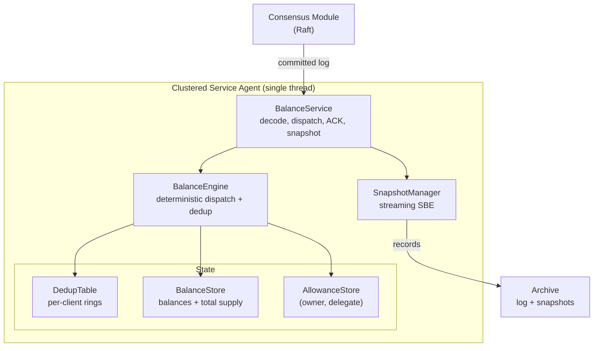

# ADBE - Aeron Distributed Balance Engine

A deterministic, replicated, in-memory balance and delegated-spending engine in
Java, built on Aeron Cluster. Strong consistency and ultra-low latency for a
core ledger: the single source of truth for balances and allowances.

## Overview

ADBE Core is a strongly consistent balance processing engine for low-latency,
high-throughput workloads. It runs as a single Aeron `ClusteredService`
replicated by Raft, and does exactly one thing well: execute deterministic state
transitions on balance and allowance state. Every command is idempotent, every
result is byte-reproducible across nodes, and the hot path is allocation-free.

It targets the same class of problems as deterministic ledgers and replicated
state machines: financial cores, event-sourced systems, and any service where a
double-applied command or a nondeterministic replay is a correctness failure.

## Features

- **Deterministic**: identical input logs produce byte-identical state and
  snapshots across nodes and reruns.
- **Idempotent**: a per-client dedup window guarantees every command is applied
  at most once, even across Edge retries and failover.
- **Allocation-Free Hot Path**: zero heap allocation during decode, dispatch,
  and ACK in steady state.
- **Lock-Free Single-Writer**: one clustered-service thread owns all state; no
  locks, no atomics, no contention.
- **Crash Tolerant**: state is recoverable from the replicated log; controlled
  snapshots include the dedup table so idempotency survives recovery.
- **Overflow-Safe**: 64-bit fixed-scale amounts with checked arithmetic; overflow
  returns a status code, never a silent wrap-around.
- **SBE Wire Format**: fixed binary layout, no reflection, backward-compatible
  schema evolution via optional fields.

> Requires JDK 21 and Linux. Aeron/Agrona need the JVM flags
> `--add-opens java.base/jdk.internal.misc=ALL-UNNAMED` and
> `--add-opens java.base/sun.nio.ch=ALL-UNNAMED`.

## Installation

ADBE is a Gradle multi-module project. Build it from source:

```bash
git clone <repo-url> adbe && cd adbe
./gradlew build
```

To embed the engine in another Gradle build, depend on the core module:

```kotlin
dependencies {
    implementation(project(":adbe-core"))
}
```

## Quick Start

Run a single-node cluster:

```bash
./gradlew :adbe-launcher:run
```

Drive the deterministic engine directly (no cluster required), which is exactly
how the unit tests exercise it:

```java
import com.adbe.config.CoreConfig;
import com.adbe.core.BalanceEngine;
import com.adbe.core.CommandOutcome;
import com.adbe.protocol.*;
import com.adbe.telemetry.CoreMetrics;
import org.agrona.concurrent.UnsafeBuffer;

// Build an engine with preallocated, power-of-two capacities.
BalanceEngine engine = new BalanceEngine(CoreConfig.defaults(), new CoreMetrics());
CommandOutcome outcome = new CommandOutcome();

// Encode a CREDIT command with an SBE flyweight (reused, allocation-free).
UnsafeBuffer buffer = new UnsafeBuffer(new byte[256]);
MessageHeaderEncoder header = new MessageHeaderEncoder();
new CommandEnvelopeEncoder()
    .wrapAndApplyHeader(buffer, 0, header)
    .clientId(1).clientSeq(0).commandIdHi(0).commandIdLo(42)
    .commandType(CommandType.CREDIT)
    .accountA(100).accountB(0).amount(500)
    .correlationId(CommandEnvelopeEncoder.correlationIdNullValue())
    .accountC(0);

// Wrap a decoder at the message body and process the command.
MessageHeaderDecoder headerDecoder = new MessageHeaderDecoder();
CommandEnvelopeDecoder command = new CommandEnvelopeDecoder();
headerDecoder.wrap(buffer, 0);
command.wrap(buffer, MessageHeaderDecoder.ENCODED_LENGTH,
    headerDecoder.blockLength(), headerDecoder.version());

boolean duplicate = engine.process(command, outcome);
System.out.println(outcome.status());        // SUCCESS
System.out.println(outcome.resultBalance());  // 500
System.out.println(duplicate);                // false
```

Resubmitting the same `clientId` and `clientSeq` returns the cached result and
does not re-apply the command (`duplicate == true`).

## How It Works

ADBE Core is a replicated state machine. Commands flow through Aeron Cluster and
arrive at `BalanceService` in total order on a single thread:

1. **Dispatch**: `onSessionMessage` decodes the SBE envelope. The dedup table is
   checked first; a hit returns the cached result verbatim. A miss dispatches to
   a handler (credit, debit, transfer, approve, delegated transfer).
2. **Idempotency**: because `clientSeq` is monotonic per client, its dedup slot
   is `seq & (capacity - 1)`, so lookup and store are O(1) and allocation-free.
3. **ACK**: the result is encoded as an SBE `CommandResult` carrying the original
   `commandId` and offered to egress, with back-pressure handled by idling.
4. **Snapshot and Recovery**: on a controlled trigger, state is streamed to the
   Archive in deterministic key order (including the dedup table). On restart,
   the snapshot is loaded and the remaining log is replayed.

The business logic lives in `BalanceEngine`, which has no Aeron dependency and is
therefore unit and replay testable in isolation.

## Configuration

Capacities are preallocated, power-of-two, and validated in `CoreConfig`:

```java
public static final int DEFAULT_ACCOUNT_CAPACITY         = 1 << 20; // balance slots
public static final int DEFAULT_ALLOWANCE_OWNER_CAPACITY  = 1 << 16; // allowance owners
public static final int DEFAULT_DELEGATE_CAPACITY         = 1 << 4;  // delegates per owner
public static final int DEFAULT_DEDUP_CLIENT_CAPACITY     = 1 << 16; // dedup clients
public static final int DEFAULT_DEDUP_WINDOW              = 1 << 10; // commands retained per client
```

Node endpoints and directories are described by `ClusterConfig`, which provides a
`singleNodeLocalhost` default for local runs and integration tests.

## Architecture



| Module          | Responsibility                                                        |
|-----------------|-----------------------------------------------------------------------|
| `adbe-protocol` | SBE schema and generated flyweight codecs (wire and snapshot)         |
| `adbe-core`     | Deterministic engine, handlers, dedup, snapshot, telemetry            |
| `adbe-launcher` | Aeron bootstrap: Media Driver, Archive, Consensus Module, Container   |
| `adbe-tests`    | Unit, property, and integration tests plus test-only fixtures         |

Within `adbe-core`:

| Component         | Responsibility                                                    |
|-------------------|-------------------------------------------------------------------|
| `BalanceEngine`   | Idempotent dispatch over balance and allowance state              |
| `BalanceService`  | ClusteredService callbacks: decode, apply, ACK, snapshot          |
| `BalanceStore`    | Primitive balance map plus the total-supply invariant             |
| `AllowanceStore`  | Nested primitive map keyed by (owner, delegate)                   |
| `DedupTable`      | Per-client rings, O(1) idempotency within the dedup window        |
| `SnapshotManager` | Deterministic streaming snapshot write and load                   |
| `CoreMetrics`     | Single-writer observability counters                              |

See [docs/ARCHITECTURE.md](docs/ARCHITECTURE.md) for the full component map,
wire format, data flows, and determinism rules.

## Performance

Indicative micro-benchmark results on x86_64 Linux, JDK 21 (JMH quick run):

| Operation                     | Time    | Notes                                  |
|-------------------------------|---------|----------------------------------------|
| Envelope decode               | ~1.9 ns | SBE flyweight wrap plus field reads    |
| Primitive map lookup          | ~0.7 ns | `Long2LongHashMap` get                 |
| Credit dispatch (in-process)  | ~19 ns  | dedup check, handler, dedup store      |

## Performance Design

This engine is built with determinism, correctness, and tail latency as first
principles. Key architectural decisions include:

- **Allocation-free hot path**: reused flyweights and result holders; zero heap
  allocation during decode, dispatch, and ACK.
- **Single-writer model**: all state owned by one thread; no locks, no atomics.
- **Ring buffers with bitwise indexing**: `seq & (capacity - 1)`, never modulo.
- **Primitive collections**: Agrona maps with `long` keys; no boxing.
- **Deterministic iteration**: snapshot sections sort keys before emission for
  byte-identical output.
- **Overflow-checked arithmetic**: 64-bit fixed-scale amounts; overflow becomes a
  status code, never a silent wrap.
- **Little-endian SBE**: zero-overhead on x86 and ARM, deterministic on the wire.
- **Bounded everything**: capacities, dedup window, and recovery scan are all
  bounded and preallocated.

**Performance targets** (see [docs/decisions/0002-core-budget.md](docs/decisions/0002-core-budget.md)):

- Envelope decode: < 100 ns (met)
- Primitive map lookup: < 50 ns (met)
- Command dispatch: < 500 ns (met)
- Steady-state allocation: zero
- Recovery complexity: O(n) bounded over the written log

## Testing

```bash
# Run unit and property tests
./gradlew test

# Run the integration test (in-process single-node cluster)
./gradlew integrationTest

# Full gate: format, lint, compile with warnings-as-errors, test
./gradlew spotlessApply checkstyleMain checkstyleTest compileJava test integrationTest
```

### Test Coverage

| Suite                    | Type        | What it covers                                        |
|--------------------------|-------------|-------------------------------------------------------|
| `DedupIdempotencyTest`   | Unit        | Duplicate applied once; distinct sequences all apply  |
| `OverflowTest`           | Unit        | 64-bit boundary returns OVERFLOW; negative rejected   |
| `HandlerBehaviourTest`   | Unit        | Credit/debit/transfer/allowance/delegated behaviour   |
| `SnapshotRoundTripTest`  | Unit        | Byte-identical round trip and supply invariant        |
| `ReplayDeterminismTest`  | Unit        | Two engines, same log, identical snapshots            |
| `AmountsPropertyTest`    | Property    | Overflow matches `Math.addExact` (jqwik)              |
| `ClusterIntegrationTest` | Integration | End-to-end over a real cluster, idempotency verified  |

## Benchmarks

```bash
./gradlew :adbe-core:jmh                 # full run
./gradlew :adbe-core:jmh -PquickBench    # fast smoke run (CI gate)
```

Run with the GC profiler to confirm zero steady-state allocation:

```bash
./gradlew :adbe-core:jmh -Pjmh.profilers=gc
```

## License

MIT License. See [LICENSE](LICENSE) for details.

## Credits

Built on the Aeron ecosystem and its design principles:

- [Aeron](https://github.com/aeron-io/aeron) - reliable transport, archive, and cluster
- [Agrona](https://github.com/aeron-io/agrona) - primitive collections and off-heap buffers
- [Simple Binary Encoding](https://github.com/aeron-io/simple-binary-encoding) - zero-copy wire format
