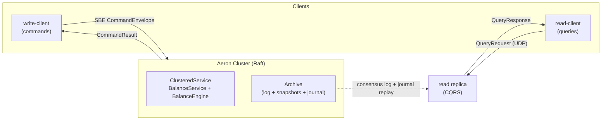

# LEDGERD - Deterministic Balance Engine on Aeron Cluster

[](https://github.com/justrade-io/ledgerd/actions/workflows/ci.yml)
[](LICENSE)
[](gradle.properties)
[](gradle/wrapper/gradle-wrapper.properties)
[](README.md)

LEDGERD is a deterministic, replicated, in-memory balance and delegated-spending
engine in Java: a strongly consistent state machine replicated by Aeron Cluster
(Raft), with multi-asset balances, two-phase holds, a CQRS read side, write/read
client SDKs, and an optional domain event journal. It is the single source of
truth for balances and allowances - and does exactly that, fast.

## Documentation

- Understand the design: [Architecture](docs/ARCHITECTURE.md) and the
  [Architecture Decision Records](docs/decisions/).
- Use the API: [API reference](docs/API-REFERENCE.md) - client SDKs, commands,
  status codes, and driving the engine directly.
- Operate it: [Operations](docs/OPERATIONS.md) - snapshots, node restart,
  deployment, Prometheus metrics.
- Contribute: [Contributing](CONTRIBUTING.md) and [Security](SECURITY.md).

## Why

Balance ledgers are correctness-critical: every command must apply exactly once
even across retries and leader failover, settlement must conserve value, and
results must be reproducible for audit and reconciliation.

LEDGERD solves this as a single deterministic state machine replicated by Aeron
Cluster. The engine has no clock, no randomness, no floating point, and no
unordered iteration: identical input logs produce byte-identical state and
snapshots on every node and every rerun. Commands are idempotent by design, and
the steady-state hot path allocates nothing. It targets financial cores,
event-sourced systems, and any service where a double-applied command or a
nondeterministic replay is a correctness failure.

## Highlights

- **Deterministic and reproducible** - identical input logs produce
  byte-identical state and snapshots on every node, so replicas and archived
  logs always reconcile.
- **Exactly-once, even across failover** - a per-client dedup window
  (`clientId`, `clientSeq`) makes every command idempotent; retries, a leader
  change, or a killed leader can never double-apply.
- **Zero-allocation, lock-free hot path** - one clustered-service thread owns
  all state; decode, dispatch, and ACK allocate nothing in steady state. The
  contract is the tail, not the mean.
- **Financially correct** - integer-only 64-bit fixed-scale arithmetic with
  overflow checks (never a silent wrap), multi-asset isolation (ADR 0009), and
  `RESERVE` / `CAPTURE` / `RELEASE` two-phase holds with conserved supply
  (ADR 0010).
- **Batched transfers with atomic chains** - one `TransferBatch` message carries
  many transfer legs and amortizes the per-message consensus cost; contiguous
  `linked` legs commit or roll back together (ADR 0012).
- **Reads without touching consensus** - a CQRS read replica follows a member's
  Aeron Archive and answers balance / allowance / supply queries over a plain
  Aeron protocol, failing over across every member's Archive (ADR 0006, 0008).
- **Decoupled fan-out** - an opt-in, deterministic domain event journal emits
  semantic facts off the consensus hot path, recorded per member for downstream
  consumers (ADR 0011).

## System diagram



## Quick start

Requires JDK 21 and Linux (the Aeron media driver). Gradle run tasks set the
required `--add-opens` flags automatically.

```bash
# Build everything
./gradlew build

# In-process single-node cluster that submits a credit and a transfer
./gradlew :examples:run

# Run a single-node cluster
./gradlew :launcher:run
```

Multi-node runs, driving the deterministic engine directly, the client SDK
walkthrough, and configuration are in
[docs/API-REFERENCE.md](docs/API-REFERENCE.md) and
[docs/OPERATIONS.md](docs/OPERATIONS.md).

## Modules

| Module | Responsibility |
|--------|----------------|
| [`protocol`](protocol/README.md) | SBE schema and generated flyweight codecs (wire contract only) |
| [`core`](core/README.md) | Deterministic engine: handlers, dedup, snapshot, event journal ring, telemetry |
| [`launcher`](launcher/README.md) | Aeron bootstrap: media driver, archive, consensus, container, journaler |
| [`write-client`](write-client/README.md) | Write-side SDK: leader-change handling, idempotent retry, correlation |
| [`read`](read/README.md) | CQRS read replica: Archive replication + failover, Aeron query responder, event follower |
| [`read-client`](read-client/README.md) | Read-side SDK over plain Aeron request/response streams |
| [`examples`](examples/README.md) | Runnable examples (QuickStart, RemoteClient) |
| [`tests`](tests/README.md) | Unit, property, integration, cluster, fault, and soak suites |

Wire and snapshot formats, data flows, and determinism rules live in
[docs/ARCHITECTURE.md](docs/ARCHITECTURE.md).

## Performance

Indicative JMH numbers on x86_64 Linux, JDK 21 (steady state, zero allocation):

| Operation | Time |
|-----------|------|
| Envelope decode | ~1.9 ns |
| Primitive map lookup | ~0.8 ns |
| Credit dispatch (in-process) | ~24 ns |
| Batch leg dispatch (in-process) | ~22 ns/leg |

Targets: decode < 100 ns, primitive-map lookup < 50 ns, command dispatch
< 500 ns, hot-path allocation 0 bytes. See the
[performance budget](docs/decisions/0002-core-budget.md). Baseline numbers a
reviewer can diff against are committed in
[benchmark-baseline.txt](benchmark-baseline.txt).

## License

MIT License. See [LICENSE](LICENSE).

## Credits

Built on [Aeron](https://github.com/aeron-io/aeron),
[Agrona](https://github.com/aeron-io/agrona), and
[Simple Binary Encoding](https://github.com/aeron-io/simple-binary-encoding).
