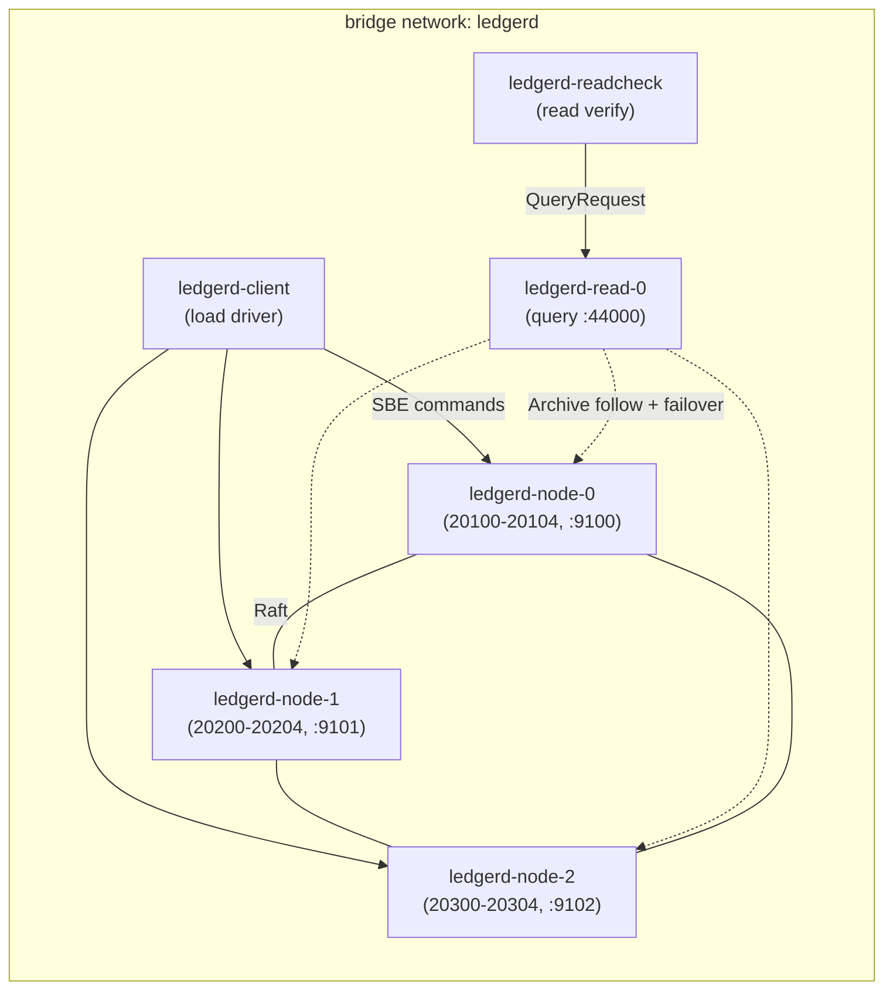

# Docker Topology

Containerized full-topology deployment for LEDGERD, matching ADR 0006/0007/0008:
a 3-node Raft write cluster plus one standalone read replica, with a remote load
driver and a read-verification tool run as one-off containers.

## Prerequisites

- Docker 20+ with Compose v2 (and BuildKit, the default).
- Linux host (Aeron media driver is Linux-only).

## Topology



## Build and run

```bash
# One-shot smoke: build, ~10k load, snapshot, node-0 kill, read failover.
./docker/smoke-verify.sh

# Or bring the topology up manually and leave it running.
docker compose -f docker/docker-compose.yml up -d \
  ledgerd-node-0 ledgerd-node-1 ledgerd-node-2 ledgerd-read-0

# Drive a custom load (client exits when done).
docker compose -f docker/docker-compose.yml run --rm --no-deps \
  -e LEDGERD_TOTAL=100000 ledgerd-client

# Verify read convergence (expected supply must match the load run).
docker compose -f docker/docker-compose.yml run --rm --no-deps \
  -e LEDGERD_EXPECT_SUPPLY=100000 \
  -e LEDGERD_EXPECT_BALANCE_B=100000 \
  ledgerd-readcheck

# Metrics are published on the host for inspection.
curl http://localhost:9100/metrics
curl http://localhost:9100/healthz
```

### Fault injection: kill the leader mid-flight

```bash
# Kill the current leader while the production write-client is mid-flight under
# sustained load, and assert exactly-once across the leadership change.
./docker/fault-verify.sh
```

## Notes

- The single image (`ledgerd:local`) hosts every role; `LEDGERD_ROLE` dispatches
  the entrypoint to a node, the read replica, the load driver, or the read check.
- Each node's Archive / cluster / media-driver state lives on a named volume, so
  `down -v` is required for a clean slate. Nodes default to `LEDGERD_CLEAN_START=true`.
- This is a correctness / scale / HA harness, not a latency benchmark: Docker
  networking adds overhead. Tail-latency contracts are asserted by `soakTest` and
  JMH on bare metal, not here.
