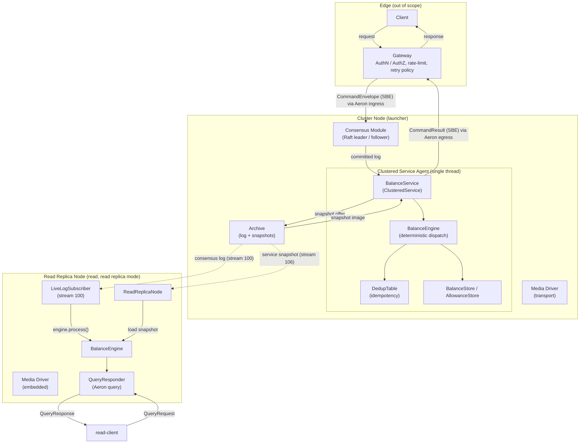
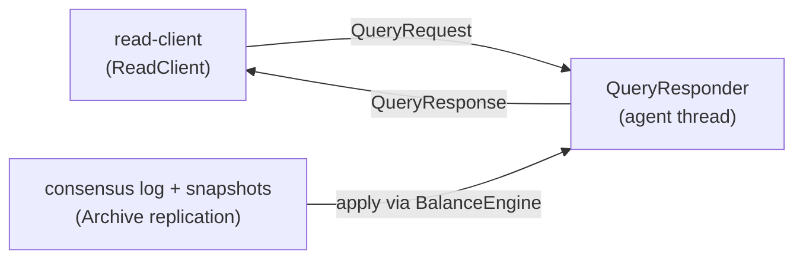
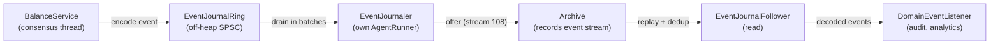
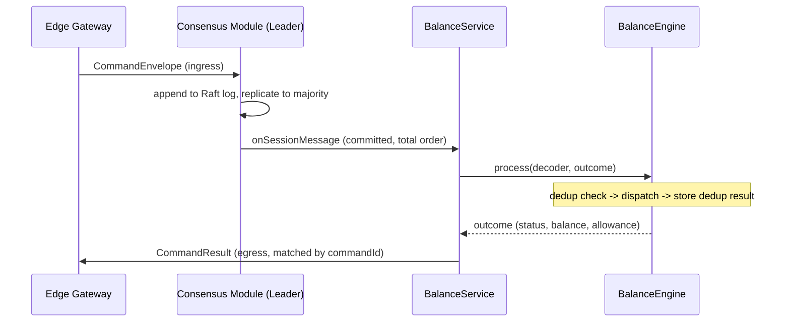
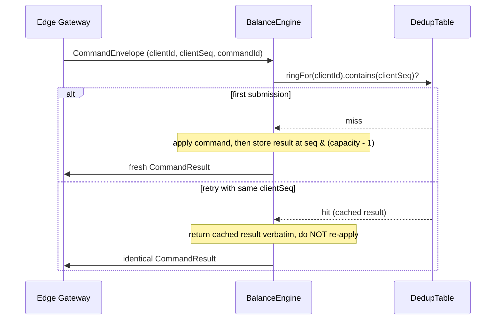
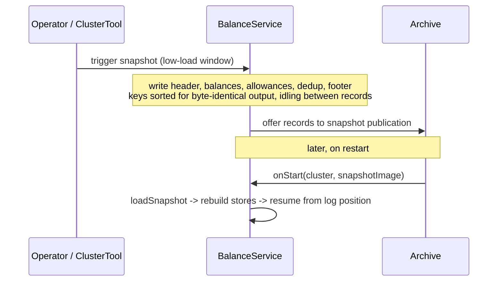
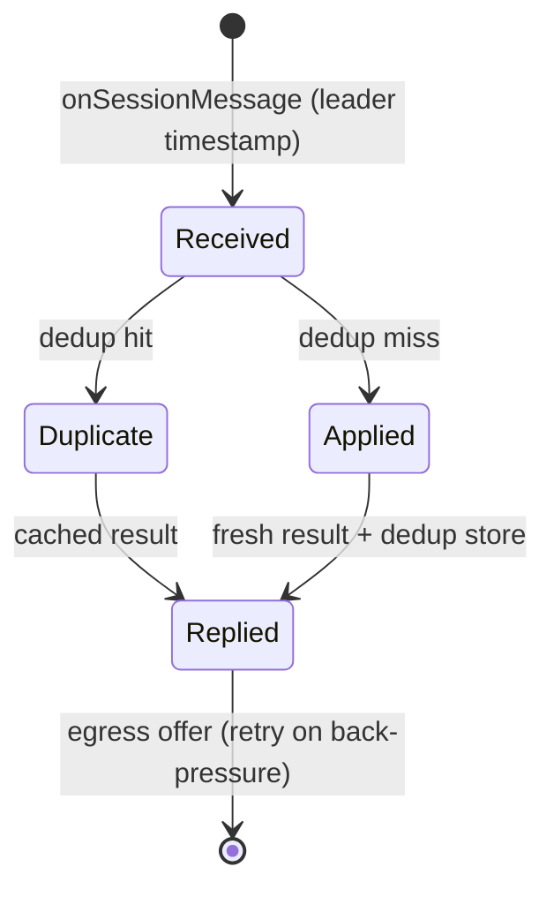
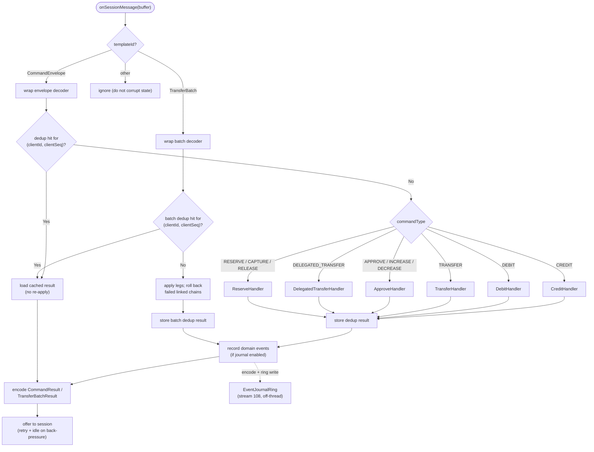

# Architecture

> **Deterministic, replicated, in-memory balance and delegated-spending engine
> built on Aeron Cluster, targeting strong consistency and ultra-low latency.**

---

## Table of Contents

- [Overview](#overview)
- [Workspace Layout](#workspace-layout)
- [System Diagram](#system-diagram)
- [Module Structure](#module-structure)
    - [protocol - Wire and Snapshot Codecs](#protocol---wire-and-snapshot-codecs)
    - [core - Deterministic State Machine](#core---deterministic-state-machine)
    - [launcher - Cluster Bootstrap](#launcher---cluster-bootstrap)
    - [write-client - Edge Client SDK](#write-client---edge-client-sdk)
    - [read - Read Side (CQRS Query)](#read---read-side-cqrs-query)
    - [read-client - Read Client SDK](#read-client---read-client-sdk)
    - [tests - Verification and Fixtures](#tests---verification-and-fixtures)
- [Wire Format](#wire-format)
- [Domain Event Journal](#domain-event-journal)
- [Data Flows](#data-flows)
    - [Flow 1 - Command Dispatch and ACK](#flow-1---command-dispatch-and-ack)
    - [Flow 2 - Idempotent Retry](#flow-2---idempotent-retry)
    - [Flow 3 - Snapshot and Recovery](#flow-3---snapshot-and-recovery)
    - [Flow 4 - Session Lifecycle](#flow-4---session-lifecycle)
- [Command Processing Pipeline](#command-processing-pipeline)
- [Determinism Rules](#determinism-rules)
- [Snapshot Format](#snapshot-format)
- [Configuration](#configuration)
- [Test Coverage](#test-coverage)
- [Build and Run](#build-and-run)

---

## Overview

LEDGERD Core is the single source of truth for account balances and delegated
allowances. It runs as one Aeron `ClusteredService` replicated by Raft, and does
exactly one thing: execute deterministic state transitions on balance and
allowance state.

Two concerns, strictly separated:

- **Business logic** (`BalanceEngine`) - pure, single-writer, allocation-free,
  free of any Aeron dependency so it can be unit and replay tested in isolation.
- **Cluster integration** (`BalanceService`) - decodes session messages, drives
  the engine, encodes results to egress, and handles snapshot read/write.

Everything the core needs arrives through the replicated log. There is no
external I/O, no local clock, and no random or GUID generation in the state
machine. Identifiers are minted at the Edge and carried in the command envelope.

Out of scope (owned by other bounded contexts): Edge gateway, authentication,
audit storage, analytics, and - for now - sharding and cross-shard atomicity
(see [decisions/0003-cross-shard-deferred.md](decisions/0003-cross-shard-deferred.md)).

---

## Workspace Layout

```
ledgerd/
|-- settings.gradle.kts             Gradle multi-module (8 modules)
|-- build.gradle.kts                Shared conventions: JDK 21, spotless, checkstyle, -Werror
|-- gradle/libs.versions.toml       Version catalog (Aeron, Agrona, SBE, JMH, ...)
|
|-- protocol/                  SBE schema + generated flyweight codecs
|   |-- build.gradle.kts            SbeTool code generation task
|   +-- src/main/resources/messages.xml   CommandEnvelope, CommandResult, snapshot + event-journal records
|
|-- core/                      Deterministic state machine (this is the hot path)
|   |-- build.gradle.kts            Determinism checkstyle config, JMH source set
|   |-- config/checkstyle/determinism.xml   Bans clocks, randomness, unordered maps, streams
|   +-- src/main/java/io/justrade/ledgerd/
|       |-- config/CoreConfig.java          Preallocated, power-of-two capacities
|       |-- util/Amounts.java               Overflow-checked 64-bit arithmetic
|       |-- collections/
|       |   |-- BalanceStore.java           Long2LongHashMap + total supply invariant
|       |   |-- AllowanceStore.java         Nested primitive map, keyed by (owner, delegate)
|       |   |-- DedupTable.java              Per-client dedup rings (idempotency)
|       |   +-- DedupRing.java               Power-of-two ring, seq & (capacity - 1)
|       |-- core/
|       |   |-- BalanceEngine.java          Dispatch + dedup (cluster-independent)
|       |   |-- BalanceService.java         ClusteredService: decode, apply, ACK, snapshot
|       |   |-- CommandOutcome.java          Reusable result holder (no per-command allocation)
|       |   +-- handlers/                    Credit, Debit, Transfer, Approve, DelegatedTransfer
|       |-- persistence/SnapshotManager.java Streaming SBE snapshot write/load
|       |-- pipeline/
|       |   |-- EventJournalRing.java        Off-heap SPSC ring for domain events (ADR 0011)
|       |   +-- EventJournalStreams.java     Event journal stream id (108) constant
|       +-- telemetry/
|           |-- CoreMetrics.java             Single-writer counters
|           |-- CounterSink.java             Allocation-free counter sink interface (NOOP default)
|           +-- AtomicCounterSink.java       Off-heap AtomicCounter-backed sink for cross-thread reads
|   +-- src/jmh/java/io/justrade/ledgerd/bench/   BalanceEngineBenchmark, SnapshotBenchmark
|
|-- launcher/                  Aeron component bootstrap
|   +-- src/main/java/io/justrade/ledgerd/launcher/
|       |-- ClusterConfig.java              Endpoints and directories per node
|       |-- ClusterNode.java                Media Driver + Archive + Consensus + Service Container
|       |-- EventJournaler.java             Drains the event ring, records stream 108 (ADR 0011)
|       |-- MetricsHttpServer.java          Optional Prometheus /metrics + /healthz endpoint
|       +-- ClusterLauncher.java            main(): start one node, block until terminated
|
|-- write-client/                    Edge client SDK (depends only on protocol)
|   +-- src/main/java/io/justrade/ledgerd/client/
|       |-- WriteClient.java                 Async submit/poll, leader-change resend, correlation
|       |-- config/ClientConfig.java        Immutable client configuration
|       +-- ResultHandler.java              Result callback correlated by command id
|
|-- read/                      Read side (CQRS query over a plain Aeron query protocol)
|   +-- src/main/java/io/justrade/ledgerd/read/
|       |-- journal/                          EventJournalFollower/Subscriber/Config, DomainEventListener, EventJournalVerifier
|       |-- config/ReadReplicaConfig.java     Read replica node config (Archive channels, snapshot, live log, query)
|       |-- ArchiveSource.java                Multi-archive endpoint with round-robin failover (ADR 0008)
|       |-- ReadStreams.java                  Consensus log / snapshot stream id constants
|       |-- ReplicationHealth.java            Volatile health state (follow / failover / integrity)
|       |-- QueryResponder.java               Aeron request/response query responder (balance/allowance/supply)
|       |-- ReadReplicaNode.java              Standalone read node: embedded driver, snapshot load, live log, query responder
|       |-- LiveLogSubscriber.java            Subscribes consensus recording, applies to engine in real time
|       +-- ReadServiceLauncher.java          Entry point: resolve env config, run the read replica node
|
|-- read-client/               Read client SDK (depends only on protocol)
|   +-- src/main/java/io/justrade/ledgerd/read/client/
|       |-- ReadClient.java                   Async submit/poll, sync queries, idempotent retry, correlation
|       |-- config/ReadClientConfig.java      Immutable read-client configuration
|       +-- BalanceResult / AllowanceResult / TotalSupplyResult / QueryListener
|
|-- examples/                  Runnable examples (QuickStart, RemoteClient)
|
|-- tests/                     Unit, property, and integration tests
|   +-- src/testFixtures/java/io/justrade/ledgerd/testkit/   Test-only helpers (NOT the Edge SDK)
|   |   |-- CommandFixtures.java             Encode envelopes, wrap decoders
|   |   |-- InMemorySnapshot.java            Snapshot to/from an in-memory buffer
|   |   |-- WorkloadGenerator.java           Deterministic pseudo-random workload
|   |   +-- ClusterTestClient.java           Minimal AeronCluster client for integration tests
|   +-- src/test/java/io/justrade/ledgerd/      Test suites (see Test Coverage)
|
+-- docs/
    |-- ARCHITECTURE.md             This document
    +-- decisions/                  Architectural source of truth (ADRs)
```

Each module organises sources by the package structure defined in the project
guidelines (`config`, `core`, `collections`, `persistence`, `telemetry`,
`util`).

---

## System Diagram



All communication between a node's components uses IPC, so they may run in one
process or several. The `ClusteredServiceAgent` polls a spy subscription of the
committed log, so every command reaches `BalanceService` in total order on a
single thread.

---

## Module Structure

### protocol - Wire and Snapshot Codecs

A dependency-only module (no dependency on `core`) holding the SBE schema
and the codecs generated from it. SBE produces type-safe flyweight encoders and
decoders that operate directly on buffers, with no reflection and no
intermediate objects. Little-endian, fixed field order.

| Message          | Template Id | Purpose                                            |
|------------------|-------------|----------------------------------------------------|
| `CommandEnvelope`| 1           | Command submitted by the Edge on behalf of a client|
| `CommandResult`  | 2           | Exactly one deterministic result per command       |
| `TransferBatch`  | 3           | A batch of transfer legs with linked atomic chains (ADR 0012) |
| `TransferBatchResult` | 4      | One result per leg, in request order (ADR 0012)    |
| `SnapshotHeader` | 10          | First snapshot record: log position, counts, supply|
| `BalanceEntry`   | 11          | One account balance (ascending assetId, accountId) |
| `AllowanceEntry` | 12          | One allowance (ascending assetId, owner, delegate) |
| `DedupEntry`     | 13          | One cached result (ascending clientId, clientSeq)  |
| `SnapshotFooter` | 14          | Terminal record with integrity checksum            |
| `AssetSupplyEntry`| 15         | Per-asset total supply (ascending assetId)         |
| `BatchDedupEntry`| 16         | One cached batch result (ascending clientId, clientSeq) |
| `BalanceChangedEvent` | 20     | Domain event: an account balance changed (ADR 0011) |
| `ReservedEvent`  | 21          | Domain event: funds moved from available to reserved |
| `CapturedEvent`  | 22          | Domain event: reserved funds settled               |
| `ReleasedEvent`  | 23          | Domain event: reserved funds returned to available |
| `TransferEvent`  | 24          | Domain event: transfer graph edge (balances carried by paired `BalanceChangedEvent`s) |
| `AllowanceChangedEvent` | 25   | Domain event: an allowance changed                 |
| `CommandRejectedEvent`  | 26   | Domain event: a command was rejected               |

Schema version 2 adds an optional `assetId` to `CommandEnvelope`, `BalanceEntry`
and `AllowanceEntry`, an optional `reserved` bucket to `BalanceEntry`, an
optional `resultReserved` to `CommandResult` / `DedupEntry`, and the
`AssetSupplyEntry` record (ADR 0009, ADR 0010). Absent optional fields decode to
the default asset (0) and zero reserved, so pre-2 snapshots and log records
replay unchanged.

Schema version 3 (additive) adds the domain event journal messages (templateIds
20-26) and an `EventCause` enum (ADR 0011). Every event opens with a fixed prefix
- `logPosition`, `timestamp`, `eventIndex` - so a consumer can peek the
`(logPosition, eventIndex)` dedup key uniformly before dispatching on templateId.
Each framed message is at most 64 bytes (one cache line).

Optional fields (`presence="optional"`) prepare the schema for
backward-compatible evolution, which SBE supports and which matters for reading
older snapshots.

### core - Deterministic State Machine

The allocation-conscious heart of the engine. `BalanceEngine` is deliberately
free of Aeron so it can run in tests; `BalanceService` adapts it to the cluster.

| Component           | Purpose                                                                 |
|---------------------|-------------------------------------------------------------------------|
| `BalanceService`    | ClusteredService callbacks: decode, dispatch, ACK, snapshot read/write  |
| `BalanceEngine`     | Idempotent dispatch over balance/allowance state (single-writer)        |
| `CommandOutcome`    | Reusable result holder, reset per command; no per-event allocation      |
| `CreditHandler`     | Increase balance and total supply, overflow-checked                     |
| `DebitHandler`      | Decrease balance and total supply, funds-checked                        |
| `TransferHandler`   | Atomic move between two accounts, total supply preserved                |
| `ApproveHandler`    | Allowance overwrite, relative increase, relative decrease               |
| `DelegatedTransferHandler` | Delegate spends owner funds, distinguishes allowance vs balance  |
| `ReserveHandler`    | Two-phase holds: RESERVE / RELEASE / CAPTURE over available and reserved |
| `TransferBatchHandler` | Applies a TransferBatch: transfer-only linked chains with a narrow undo frame (ADR 0012) |
| `BatchOutcome`      | Reusable per-leg results + staged domain events for one batch (ADR 0012) |
| `BatchDedupRing`    | Per-client ring caching batch results, separate from single-command dedup (ADR 0012) |
| `BalanceStore`      | Per-asset `AssetBucket` (available, reserved, supply) with last-asset cache |
| `AllowanceStore`    | Nested primitive map keyed by (owner, delegate), no lossy hashing       |
| `DedupTable`        | Per-client `DedupRing`s providing 100% idempotency in the dedup window  |
| `DedupRing`         | Power-of-two ring, O(1) lookup via `seq & (capacity - 1)`               |
| `SnapshotManager`   | Streaming SBE snapshot writer/loader with deterministic key ordering    |
| `EventJournalRing`  | Off-heap SPSC ring the service writes semantic events into; drained by the launcher's `EventJournaler` (ADR 0011) |
| `CoreMetrics`       | Single-writer counters (ops, duplicates, backpressure, snapshot timing) |
| `CounterSink`       | Allocation-free sink interface; NOOP default for tests, off-heap in cluster |
| `AtomicCounterSink` | Off-heap `AtomicCounter`-backed sink so external threads can read counters |

### launcher - Cluster Bootstrap

Launches and owns the Aeron components for one node and hosts a single
`BalanceService`. Internal components reach the Archive over an IPC local-control
channel; the Archive also exposes a UDP control channel for external tools.

| Component        | Purpose                                                        |
|------------------|----------------------------------------------------------------|
| `ClusterConfig`  | Endpoints and directories; `singleNodeLocalhost`, `multiNodeLocalhost`, `fromProperties` |
| `ClusterNode`    | Launches Media Driver + Archive + Consensus Module + Container; `cleanStart` controls state reuse on restart; mirrors core counters into a standalone off-heap `CountersManager` |
| `EventJournaler` | Drains the core's off-heap event ring and records it to the local Archive on stream 108, on its own `AgentRunner` thread off the consensus path (ADR 0011); active only when `eventJournalEnabled` |
| `ClusterLauncher`| Entry point: start a node (single-node or `--config` properties) and block until terminated |
| `MetricsHttpServer` | Optional Prometheus `/metrics` (and `/healthz`) endpoint exporting the off-heap counters on a daemon thread |

### write-client - Edge Client SDK

The Edge-side SDK. It depends only on the `protocol` wire contract, never on
`core`: the Edge is a separate bounded context (see ADR 0004). It adds
leader-change handling, idempotent retry (reusing the original `commandId`),
asynchronous request/response correlation, explicit backpressure signalling, and
HdrHistogram latency measurement on top of an Aeron cluster client.

| Component         | Purpose                                                        |
|-------------------|----------------------------------------------------------------|
| `WriteClient`      | Async submit/poll client: resend on leader change, correlate results by command id, record end-to-end latency |
| `ClientConfig`    | Immutable client configuration (endpoints, timeouts, retry, in-flight window) |
| `ResultHandler`   | Callback invoked when a `CommandResult` is correlated to a request |
| `PendingCommand`  | Pooled holder of an in-flight command's encoded bytes for verbatim resend |
| `BackpressureException` | Signals a full in-flight window rather than silently dropping a command |

### read - Read Side (CQRS Query)

The read (query) bounded context. Unlike the deterministic core, it may use the
system clock and heap allocation at the boundary. Reads are served by a read
replica node over a plain Aeron query protocol (`QueryRequest` / `QueryResponse`):

- **Read replica mode** (the only mode): `ReadReplicaNode` runs as a standalone
  process with its own embedded Media Driver, driven by an Agrona `Agent` /
  `AgentRunner`. It connects to a cluster member's Aeron Archive and follows the
  consensus log recording (stream 100) from the last loaded snapshot position -
  or from position 0 when no snapshot has loaded yet, so it builds state
  immediately on a fresh cluster. It also loads service snapshots (stream 106)
  as they appear, restarting the live log from the snapshot position. Because
  every member records the committed log to its own Archive, the node fails over
  across an ordered list of member Archive endpoints (`ArchiveSource`) with no
  leader discovery (ADR 0008). Reads are eventually consistent with bounded
  staleness and are answered by the `QueryResponder` on the single agent thread,
  so the single-writer discipline holds. Read replica nodes are NOT cluster
  members: they do not vote, do not affect quorum, and can be added, removed, or
  restarted independently. See ADR 0006, 0007, and 0008.

| Component            | Purpose                                                                        |
|----------------------|--------------------------------------------------------------------------------|
| `ReadReplicaNode`    | Standalone read node: embedded driver, Agent loop, snapshot load, live log follow, query responder |
| `LiveLogSubscriber`  | Subscribes consensus recording (stream 100), parses framing, applies to engine |
| `ArchiveSource`      | Owns the `AeronArchive` client; round-robin failover across member Archive endpoints (ADR 0008) |
| `ReplicationHealth`  | Volatile health (connected, applied position, failovers) for agent state tracking |
| `ReadStreams`        | Consensus log and service snapshot stream id constants                          |
| `ReadReplicaConfig`      | Immutable read replica config: Archive channels, local host, stream IDs, poll interval, live log, query channel |
| `QueryResponder`     | Serves `QueryRequest` frames from the engine on the agent thread and publishes `QueryResponse` frames |
| `ReadServiceLauncher`| Entry point configured from environment variables; runs the read replica node        |
| `journal/*`          | Domain event journal follower: `EventJournalFollower`/`Subscriber`, `DomainEventListener`, `EventJournalConfig`, and the standalone `EventJournalVerifier` (ADR 0011) |



### read-client - Read Client SDK

The read-side SDK, a separate bounded context that consumes only the `protocol`
wire contract (`QueryRequest` / `QueryResponse`), never `core` or `read`,
mirroring how `write-client` stays decoupled from the engine. It queries a read
replica's `QueryResponder` over plain Aeron request/response streams with
request-id correlation and idempotent retry.

| Component             | Purpose                                                                    |
|-----------------------|----------------------------------------------------------------------------|
| `ReadClient`          | Async submit/poll with idempotent retry, plus blocking sync queries        |
| `ReadClientConfig`    | Immutable config: request/response channels, stream ids, retry budget      |
| `QueryListener`       | Async callback sink correlated by request id                                |
| `BalanceResult` / `AllowanceResult` / `TotalSupplyResult` | Typed query results |

### tests - Verification and Fixtures

Unit, property, integration, cluster, fault, and soak tests plus a `testFixtures`
toolkit. The cluster client here is a test harness only, never the shipped Edge SDK.

| Fixture             | Purpose                                                         |
|---------------------|-----------------------------------------------------------------|
| `CommandFixtures`   | Encode a `CommandEnvelope` and return a wrapped decoder         |
| `InMemorySnapshot`  | Serialise/restore engine state via an in-memory record stream   |
| `WorkloadGenerator` | Deterministic pseudo-random command workload (seeded)           |
| `ClusterTestClient` | Minimal `AeronCluster` client that matches results by command id; supports an embedded media driver for fault tests |
| `MultiNodeCluster`  | Launches an in-process multi-node cluster; stops/restarts nodes for failover and catch-up tests |

Test suites are grouped by JUnit tag and Gradle task: `test` (unit), `integrationTest`
(single-node, tag `integration`), `clusterTest` (multi-node, tag `cluster`),
`faultTest` (leader kill, tag `fault`), and `soakTest` (sustained load, tag `soak`).
Only `test` and `integrationTest` run in the default `check` gate.

---

## Wire Format

Every command carries a `CommandEnvelope` with three identifiers that make audit
and idempotency possible without the core knowing any real user identity.

| Field         | Role                                                             |
|---------------|-----------------------------------------------------------------|
| `clientId`    | Session identity assigned by the Edge after authentication      |
| `clientSeq`   | Monotonic per-client sequence; drives the dedup window          |
| `commandId`   | Globally unique id minted at the Edge (128-bit: hi + lo)        |
| `commandType` | CREDIT, DEBIT, TRANSFER, APPROVE, INCREASE/DECREASE_ALLOWANCE, DELEGATED_TRANSFER, RESERVE, CAPTURE, RELEASE |
| `accountA/B/C`| Operands (from/owner, to/delegate, delegated-transfer target)   |
| `assetId`     | Asset dimension of the command; 0 is the default asset          |
| `amount`      | 64-bit signed value with a fixed scale                          |

The reply is a `CommandResult` carrying the original `commandId` and a
`StatusCode`: SUCCESS, INSUFFICIENT_BALANCE, INSUFFICIENT_ALLOWANCE,
INVALID_ACCOUNT, DUPLICATE, OVERFLOW, INVALID_AMOUNT, INSUFFICIENT_RESERVED.

---

## Domain Event Journal

Beyond the single `CommandResult` ACK, the core can emit a durable, deterministic
stream of *semantic facts* ("account A debited 100, new balance 400", "A
transferred 150 to B") on a dedicated egress path, off the consensus hot path
(ADR 0011). This gives a decoupled fan-out substrate - audit, analytics -
that does not have to re-execute the engine to derive state.

- **Opt-in.** Journaling is a `CoreConfig` flag (`eventJournalEnabled`, default
  off). When disabled, the hot path skips emission entirely (one predicted
  branch), so the read replica and tests that do not need it pay nothing.
- **Allocation-free emission.** Handlers record the events they produce into the
  reused `CommandOutcome` (a preallocated descriptor array). After
  `engine.process`, `BalanceService` encodes each descriptor as an SBE flyweight
  into a preallocated buffer and writes it to an off-heap SPSC
  `EventJournalRing`. Rejected commands emit a single `CommandRejectedEvent`;
  dedup hits emit nothing.
- **Deterministic ordering.** The dedup / ordering key is
  `(logPosition, eventIndex)`, a pure function of the replicated log, so it is
  identical on every member. A `TRANSFER` emits two `BalanceChangedEvent`s (debit
  and credit side) plus one `TransferEvent`, ordered by `eventIndex` and joined by
  shared `logPosition`.
- **Off the consensus thread.** The launcher's `EventJournaler` agent drains the
  ring in batches and offers each record to an `ExclusivePublication` recorded by
  the local Archive on stream 108, so Aeron I/O never runs on the single-writer
  consensus thread.
- **Per-member recording + consumer dedup.** Every member records its own event
  stream, exactly as it records the consensus log (ADR 0008). A consumer follows
  the first reachable member and, on failure, fails over to the next, deduplicating
  by `(logPosition, eventIndex)` so a re-followed prefix is idempotent.



---

## Data Flows

### Flow 1 - Command Dispatch and ACK



### Flow 2 - Idempotent Retry



### Flow 3 - Snapshot and Recovery



### Flow 4 - Session Lifecycle



---

## Command Processing Pipeline

`onSessionMessage` is the only place business logic runs. The fast, common path
comes first; error and cold branches live in small private methods.



---

## Determinism Rules

The state machine must produce byte-identical results on every node. The
following are forbidden in `core` and enforced by a Checkstyle rule set
([core/config/checkstyle/determinism.xml](../core/config/checkstyle/determinism.xml)):

- No `System.currentTimeMillis()` / `System.nanoTime()`. The only time source is
  the leader-assigned `timestamp` parameter.
- No `Math.random()` or `UUID.randomUUID()`. Identifiers are minted at the Edge.
- No `java.util.HashMap` / `TreeMap` / `ConcurrentHashMap`. Use Agrona primitive
  maps; iteration for snapshots sorts keys explicitly.
- No `Optional`, no `BigDecimal`, no streams, no `String.format`, no blocking
  primitives on the hot path.

Money and allowances are 64-bit signed `long` values; overflow is detected and
returned as `StatusCode.OVERFLOW` rather than thrown, so exceptions are never
used for control flow.

---

## Snapshot Format

Records are written one at a time into a reusable buffer sized to the largest
record (a batch dedup entry) and offered to the Archive, so the writer never
allocates a dataset-sized buffer. The order is fixed, and keys within each
section are sorted so two nodes produce identical bytes.

```
[SnapshotHeader]       logPosition, schemaVersion, counts, totalSupply
[BalanceEntry...]      sorted by (assetId, accountId), carrying available + reserved
[AllowanceEntry...]    sorted by (assetId, ownerId, delegateId)
[DedupEntry...]        sorted by (clientId, clientSeq)   <-- command idempotency survives recovery
[BatchDedupEntry...]   sorted by (clientId, clientSeq)   <-- batch idempotency survives recovery (ADR 0012)
[AssetSupplyEntry..]   sorted by assetId
[SnapshotFooter]       checksum (sum of balances)
```

On load, records are fed to `SnapshotManager.onRecord` in the same order; the
footer confirms completion and the checksum verifies the invariant
`sum(balances) == totalSupply`.

---

## Configuration

`CoreConfig` holds preallocated, power-of-two capacities validated at
construction. Defaults suit a large single node; tests use smaller values.

| Setting                  | Default | Purpose                                       |
|--------------------------|---------|-----------------------------------------------|
| `accountCapacity`        | 2^20    | Preallocated balance-map slots                |
| `allowanceOwnerCapacity` | 2^16    | Preallocated allowance owners                 |
| `delegateCapacity`       | 2^4     | Per-owner delegate slots                      |
| `dedupClientCapacity`    | 2^16    | Preallocated dedup clients                    |
| `dedupWindow`            | 2^10    | Most recent commands retained per client      |
| `maxBatchSize`           | 2^10    | Max transfer legs per batch (ADR 0012)        |
| `batchDedupWindow`       | 2^10    | Most recent batches retained per client       |

`ClusterConfig` provides node id, cluster members, directories, and channels; the
JVM must run with `--add-opens java.base/jdk.internal.misc=ALL-UNNAMED` and
`--add-opens java.base/sun.nio.ch=ALL-UNNAMED` for Aeron/Agrona.

---

## Test Coverage

| Suite                       | Type        | What it covers                                             |
|-----------------------------|-------------|------------------------------------------------------------|
| `DedupIdempotencyTest`      | Unit        | Duplicate command applied exactly once; distinct seqs all apply |
| `OverflowTest`              | Unit        | 64-bit boundary returns OVERFLOW; negative amount rejected |
| `HandlerBehaviourTest`      | Unit        | Credit/debit/transfer/allowance/delegated cases and status codes |
| `HoldsTest`                 | Unit        | RESERVE / CAPTURE / RELEASE buckets and conserved supply (ADR 0010) |
| `MultiAssetTest`            | Unit        | Per-asset isolation of balance, allowance, and supply (ADR 0009) |
| `TransferBatchTest`         | Unit        | Batch apply, linked chains, rollback, idempotency (ADR 0012) |
| `TransferBatchPropertyTest` | Property    | Random batches are deterministic (jqwik) |
| `TransferBatchSnapshotTest` | Unit        | Batch dedup survives snapshot round-trip (ADR 0012) |
| `EventRecordingTest`        | Unit        | Domain events emitted per command, `(logPosition, eventIndex)` order (ADR 0011) |
| `SnapshotRoundTripTest`     | Unit        | Write then load reproduces byte-identical state and invariant |
| `SnapshotIntegrityTest`     | Unit        | Snapshot footer checksum detects corruption                |
| `ReplayDeterminismTest`     | Unit        | Two engines replaying the same log produce identical snapshots |
| `AmountsPropertyTest`       | Property    | Overflow detection matches `Math.addExact` (jqwik)         |
| `EventJournalRingTest`      | Unit        | Off-heap event ring SPSC framing and batch drain           |
| `MetricsHttpServerTest`     | Unit        | Prometheus metrics and healthz HTTP endpoint               |
| `ClusterIntegrationTest`    | Integration | End-to-end over a real single-node cluster, idempotency verified |
| `TransferBatchClusterIntegrationTest` | Integration | TransferBatch through consensus: per-leg ACK, idempotency, rollback (ADR 0012) |
| `WriteClientIntegrationTest` | Integration | Client SDK submit/poll, command-id correlation             |
| `EventJournalIntegrationTest` | Integration | Event journal recorded and followed end-to-end (ADR 0011)  |
| `EventJournalBatchIntegrationTest` | Integration | Batch event journal: committed legs emit edges, rolled-back chains emit rejections (ADR 0012) |
| `EventJournalFollowerIntegrationTest` | Integration | Follower dedup and multi-archive failover               |
| `ReadClientIntegrationTest` | Integration | Read-client sync/async queries, request-id correlation     |
| `ReadReplicaQueryIntegrationTest`| Integration | Read-after-write via read-client SDK; both sides of a transfer |
| `ReadReplicaReplicationIntegrationTest` | Integration | Read replica snapshot replication end-to-end            |
| `ReadReplicaLiveLogIntegrationTest` | Integration | Read replica live log following, sub-second staleness       |
| `ReadReplicaNodeSmokeTest`  | Integration | Read replica node startup and basic query                  |
| `MultiNodeClusterTest`      | Cluster     | Three-node leader election and committed results           |
| `TransferBatchClusterTest`  | Cluster     | TransferBatch across failover applies exactly once (ADR 0012) |
| `CatchUpReplayTest`         | Cluster     | Restarted node recovers its log and rejoins consensus      |
| `ClusterReplayDeterminismTest` | Cluster  | Identical command streams yield identical balances         |
| `ReadReplicaArchiveModelClusterTest` / `ReadReplicaSnapshotLoadClusterTest` | Cluster | Read replica archive replication and snapshot load against a real cluster |
| `FaultInjectionTest`        | Fault       | Leader killed mid-flight; retry applies exactly once       |
| `ReadReplicaArchiveFailoverFaultTest` | Fault | Read replica fails over across member Archives (ADR 0008)  |
| `ChaosSoakTest`             | Soak        | Sustained load within the tail-latency budget              |

Test suites are grouped by JUnit tag and Gradle task: `test` (unit, no tag),
`integrationTest` (tag `integration`), `clusterTest` (tag `cluster`), `faultTest`
(tag `fault`), and `soakTest` (tag `soak`). Only `test` and `integrationTest`
run in the default `check` gate.

---

## Build and Run

```bash
# Format, lint, compile (warnings are errors), and test
./gradlew spotlessApply
./gradlew checkstyleMain checkstyleTest
./gradlew compileJava
./gradlew test integrationTest

# Micro-benchmarks (add -PquickBench for a fast smoke run)
./gradlew :core:jmh -PquickBench
./gradlew :read:jmh -PquickBench

# Run a single-node cluster
./gradlew :launcher:run

# Run a read node (eventually-consistent Aeron query API)
./gradlew :read:run
```

Toolchain: JDK 21 LTS. Aeron 1.48, Agrona 2.2, SBE 1.35. The dependency chain
for changes: a schema change in `protocol` regenerates codecs used by
`core`, `launcher`, `read-client`, and `tests`, so all layers rebuild together.
