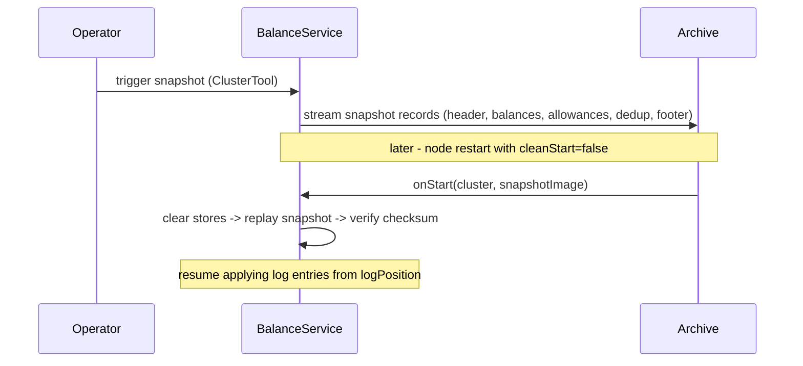

# LEDGERD Operations Guide

This guide covers cluster deployment, snapshot management, node recovery, capacity tuning, and
observability for LEDGERD operators and SREs. For the client integration surface see
[API-REFERENCE.md](API-REFERENCE.md). For system internals see [ARCHITECTURE.md](ARCHITECTURE.md).

---

## Table of Contents

1. [JVM Requirements](#1-jvm-requirements)
2. [Running a Single Node](#2-running-a-single-node)
3. [Running a Multi-Node Cluster](#3-running-a-multi-node-cluster)
4. [Snapshot Management](#4-snapshot-management)
5. [Node Restart and Recovery](#5-node-restart-and-recovery)
6. [CoreConfig Capacity Reference](#6-coreconfig-capacity-reference)
7. [Prometheus Metrics](#7-prometheus-metrics)
8. [Read Service (HTTP Query API)](#8-read-service-http-query-api)
9. [Domain Event Journal](#9-domain-event-journal)
10. [AI Risk Service](#10-ai-risk-service)

---

## 1. JVM Requirements

Aeron and Agrona require the following JVM flags. Add them to `JAVA_TOOL_OPTIONS` or the launcher
command line:

```bash
--add-opens java.base/jdk.internal.misc=ALL-UNNAMED
--add-opens java.base/sun.nio.ch=ALL-UNNAMED
```

These are already wired in the Gradle `jvmArgs` block and in the Docker images. Manual deployments
must set them explicitly.

**Recommended GC** for production:

| Workload                                       | GC strategy                  |
|------------------------------------------------|------------------------------|
| General low-latency (default)                  | ZGC or Shenandoah            |
| Zero-GC operational window (trading sessions)  | Epsilon GC + sized heap      |
| Non-critical / monitoring nodes                | G1                           |

---

## 2. Running a Single Node

### Gradle (development / CI)

```bash
# Fresh single-node cluster; state cleared on each start.
./gradlew :launcher:run

# Preserve state across restarts.
./gradlew :launcher:run -Dledgerd.nodeId=0 -Dledgerd.cleanStart=false

# Custom base directory.
./gradlew :launcher:run -Dledgerd.baseDir=/var/ledgerd/node-0

# Expose Prometheus metrics on port 9100.
./gradlew :launcher:run -Dledgerd.metricsPort=9100

# Enable the opt-in domain event journal (ADR 0011); records to Archive stream 108.
./gradlew :launcher:run -Dledgerd.eventJournal=true
```

### Properties file (production)

```bash
./gradlew :launcher:run --args="--config=production.properties"
# or
java -jar launcher.jar --config=production.properties
```

Recognised properties:

| Key                  | Required | Default                          | Description                                    |
|----------------------|:--------:|----------------------------------|------------------------------------------------|
| `ledgerd.clusterMembers`| yes      | -                                | Aeron member string (see Section 3).           |
| `ledgerd.baseDir`       | no       | `build/ledgerd-node-<id>`           | Root directory for archive and cluster state.  |
| `ledgerd.host`          | no       | `localhost`                      | This node's advertised host for ingress.       |

Node id is supplied via `ledgerd.nodeId` system property or defaults to `0`.

---

## 3. Running a Multi-Node Cluster

### Aeron member string format

Each node in `ledgerd.clusterMembers` has six comma-separated fields:

```
<id>,<ingress>,<consensus>,<log>,<catchup>,<archive>
```

For a three-node cluster on `localhost` (ports follow `PORT_BASE=20100`, `PORT_STRIDE=100`):

```
0,localhost:20100,localhost:20101,localhost:20102,localhost:20103,localhost:20104|1,localhost:20200,...|2,localhost:20300,...
```

### Local three-node cluster (Gradle)

```bash
# Terminal 0
./gradlew :launcher:run -Dledgerd.nodeId=0 -Dledgerd.config=local-3node.properties

# Terminal 1
./gradlew :launcher:run -Dledgerd.nodeId=1 -Dledgerd.config=local-3node.properties

# Terminal 2
./gradlew :launcher:run -Dledgerd.nodeId=2 -Dledgerd.config=local-3node.properties
```

All three nodes share the same `ledgerd.clusterMembers` string in `local-3node.properties`; each
supplies its own `ledgerd.nodeId` on the command line.

### Docker Compose

```bash
# Start three-node cluster.
docker compose up --build

# Run smoke-test client against the live cluster.
docker compose run --rm client
```

Node 0 exposes ingress port `20100/udp` to the host. Prometheus endpoints are available at
`localhost:9100`, `localhost:9101`, `localhost:9102`.

The `LEDGERD_INGRESS_ENDPOINTS` and `LEDGERD_EGRESS_ENDPOINT` environment variables in the compose file
configure which host the client connects to and which address it advertises for egress delivery.

---

## 4. Snapshot Management

### What is snapshotted

Every snapshot includes balances, allowances, and the full dedup table. This means idempotency
guarantees survive a restart: a node restarted from snapshot returns `DUPLICATE` for any command
already applied before the snapshot was taken.

### Triggering a snapshot

Snapshots are requested via the Aeron `ClusterTool`. The consensus module routes the request
through the Raft log so every node takes the snapshot at the same log position, producing
byte-identical output.

```bash
# clusterDir is the node's cluster state directory (ledgerd.baseDir/cluster by default).
java -cp aeron-all.jar io.aeron.cluster.ClusterTool \
    build/ledgerd-node-0/cluster \
    snapshot
```

Take snapshots during low-load windows. The `onTakeSnapshot` callback runs on the single
`ClusteredServiceAgent` thread; it does not block command processing but does consume agent time
while streaming records.

### Snapshot record order

Records are written one at a time into a 64-byte reusable buffer. Keys are sorted within each
section so any two healthy nodes produce byte-identical snapshots.

```
[SnapshotHeader]    logPosition, schemaVersion, balanceCount, allowanceCount,
                    dedupCount, totalSupply
[BalanceEntry...]   ascending by accountId
[AllowanceEntry..] ascending by (ownerId, delegateId)
[DedupEntry...]     ascending by (clientId, clientSeq)
[SnapshotFooter]    checksum = sum(all balances) - must equal totalSupply
```

**Integrity check**: `SnapshotManager.verifyInvariant()` confirms `sum(balances) == totalSupply`
after load, and that the terminating footer was seen. It is enforced on every recovery: the
cluster service (`BalanceService`) aborts startup on a mismatch so a corrupt or truncated snapshot
never becomes committed state, and a read replica discards the failed load and rebuilds from the
consensus log (surfacing an `integrityFailures` count on `/metrics`). A mismatch indicates snapshot
corruption or truncation.

---

## 5. Node Restart and Recovery

### cleanStart flag

| `cleanStart` | Behaviour                                                                 |
|:------------:|---------------------------------------------------------------------------|
| `true` (default) | Deletes prior archive and cluster directories; starts a fresh cluster. |
| `false`          | Preserves directories; recovers from the latest snapshot, then replays the remaining log. |

```bash
# Preserve and recover.
./gradlew :launcher:run -Dledgerd.nodeId=0 -Dledgerd.cleanStart=false

# Programmatically.
ClusterNode node = new ClusterNode(clusterConfig, CoreConfig.defaults(), /*cleanStart=*/ false);
```

### Recovery flow



### What survives restart

| State                              | Persisted | Detail                                                            |
|------------------------------------|:---------:|-------------------------------------------------------------------|
| Account balances                   | yes       | All accounts and their exact balances.                            |
| Allowances                         | yes       | All (owner, delegate, allowance) triples.                         |
| Dedup table                        | yes       | Cached results within the dedup window. Idempotency holds.        |
| Pending in-flight commands (client)| no        | `WriteClient` retransmits automatically via `onNewLeader` callback.|

---

## 6. CoreConfig Capacity Reference

All capacities are pre-allocated at node start, validated as power-of-two, and never grow during
operation. Size them for peak steady-state; over-sizing wastes memory, under-sizing causes
`IllegalArgumentException` at startup.

| Setting                   | Default  | Computed default  | Purpose                                               |
|---------------------------|----------|-------------------|-------------------------------------------------------|
| `accountCapacity`         | `1 << 20`| 1 048 576         | Balance-map slots. One slot per distinct account id.  |
| `allowanceOwnerCapacity`  | `1 << 16`| 65 536            | Distinct allowance owners.                            |
| `delegateCapacity`        | `1 << 4` | 16                | Delegate slots per owner.                             |
| `dedupClientCapacity`     | `1 << 16`| 65 536            | Distinct client ids tracked by the dedup table.       |
| `dedupWindow`             | `1 << 10`| 1 024             | Most recent commands retained per client (ring size). |

**Tuning rules**:
- All values must be powers of two. `CoreConfig.of(...)` validates at construction.
- `accountCapacity` should exceed expected peak distinct accounts by at least 30 % to keep the
  Agrona `Long2LongHashMap` load factor below `0.6`.
- `dedupWindow` determines how many commands per client survive a retransmit window. Size it to
  cover `maxRetries * retryBackoffNs` at your peak submit rate.

Custom capacities:

```java
// e.g. smaller footprint for a development / test node.
CoreConfig config = CoreConfig.of(
        1 << 16,  // accountCapacity
        1 << 12,  // allowanceOwnerCapacity
        1 << 4,   // delegateCapacity
        1 << 12,  // dedupClientCapacity
        1 << 8);  // dedupWindow
```

---

## 7. Prometheus Metrics

Enable the HTTP endpoint with `-Dledgerd.metricsPort=<port>`. The server binds `0.0.0.0:<port>` on a
daemon thread and reads off-heap counters with acquire ordering, never touching the service thread.

```bash
./gradlew :launcher:run -Dledgerd.metricsPort=9100
curl http://localhost:9100/metrics
curl http://localhost:9100/healthz   # returns "ok"
```

### Counter metrics (monotonic)

| Metric name                    | Description                                                        |
|--------------------------------|--------------------------------------------------------------------|
| `ledgerd_commands_processed`      | Total commands applied (excluding duplicates).                     |
| `ledgerd_duplicates_detected`     | Commands returned from dedup cache without re-applying.            |
| `ledgerd_insufficient_balance`    | Commands rejected with `INSUFFICIENT_BALANCE`.                     |
| `ledgerd_insufficient_allowance`  | Commands rejected with `INSUFFICIENT_ALLOWANCE`.                   |
| `ledgerd_invalid_account`         | Commands rejected with `INVALID_ACCOUNT`.                          |
| `ledgerd_overflow`                | Commands rejected with `OVERFLOW`.                                 |
| `ledgerd_invalid_amount`          | Commands rejected with `INVALID_AMOUNT`.                           |
| `ledgerd_backpressure_events`     | Egress back-pressure events on the service thread.                 |
| `ledgerd_leader_elections`        | Leader elections observed by this node since start.                |

### Gauge metrics (current value)

| Metric name                    | Description                                                        |
|--------------------------------|--------------------------------------------------------------------|
| `ledgerd_snapshot_write_nanos`    | Duration of the last snapshot write in nanoseconds.                |
| `ledgerd_snapshot_read_nanos`     | Duration of the last snapshot load in nanoseconds.                 |
| `ledgerd_balance_count`           | Current number of distinct accounts in the balance map.            |
| `ledgerd_allowance_owner_count`   | Current number of distinct allowance owners.                       |
| `ledgerd_dedup_client_count`      | Current number of distinct clients tracked by the dedup table.     |

### Prometheus scrape config example

```yaml
scrape_configs:
  - job_name: ledgerd
    static_configs:
      - targets:
          - ledgerd-node-0:9100
          - ledgerd-node-1:9101
          - ledgerd-node-2:9102
```

### Alerting recommendations

- **`ledgerd_commands_processed` growth rate drops to zero**: cluster has stalled; check leader
  election and ingress connectivity.
- **`ledgerd_backpressure_events` rising**: egress channel to a client is slow; check client-side
  `poll()` rate and network.
- **`ledgerd_balance_count` approaching `accountCapacity`**: resize before the map load factor
  degrades; plan a rolling restart with a larger `CoreConfig`.
- **`ledgerd_snapshot_write_nanos` suddenly large**: snapshot took longer than expected; check I/O on
  the archive directory.

---

## 8. Read Service (HTTP Query API)

The read service (`read`) serves eventually-consistent balance, allowance,
and total-supply reads over HTTP via a read replica node. `ReadReplicaNode` runs
as a standalone process, independent of the Raft cluster: it connects to the
write cluster members' Aeron Archives, follows the consensus log recording (from
the position it has applied up to, or from position 0 on a fresh replica), loads
service snapshots as they appear, and serves reads from the engine. It accepts
multiple Archive endpoints (one per member) and fails over between them, so the
loss of any single member's Archive does not freeze reads. It is NOT a cluster
member: it does not vote, does not affect quorum, and can be added, removed, or
restarted independently. See ADR 0006, 0007, and 0008.

### Running a read replica node

```bash
# Gradle (development): standalone read replica. Configure every member's Archive
# so the node can fail over (ADR 0008); a single channel also works (legacy).
LEDGERD_ARCHIVE_CHANNELS="aeron:udp?endpoint=localhost:20104,aeron:udp?endpoint=localhost:20204,aeron:udp?endpoint=localhost:20304" \
    ./gradlew :read:run

# Standalone process with live log following.
java \
    --add-opens java.base/jdk.internal.misc=ALL-UNNAMED \
    --add-opens java.base/sun.nio.ch=ALL-UNNAMED \
    -cp 'read/build/libs/*' io.justrade.ledgerd.read.ReadServiceLauncher
```

Recognised environment variables:

| Variable                  | Required | Default                               | Description                                           |
|---------------------------|:--------:|---------------------------------------|-------------------------------------------------------|
| `LEDGERD_ARCHIVE_CHANNELS`   | no*      | `aeron:udp?endpoint=localhost:20104`  | Comma-separated Archive control channels, one per cluster member; the node fails over across them (ADR 0008). |
| `LEDGERD_ARCHIVE_CHANNEL`    | no*      | `aeron:udp?endpoint=localhost:20104`  | Single Archive control channel (legacy fallback when `LEDGERD_ARCHIVE_CHANNELS` is unset). |
| `LEDGERD_LOCAL_HOST`         | no       | `localhost`                           | Routable host for Archive call-backs (control response + replays). Set to the container address in Docker. |
| `LEDGERD_HTTP_PORT`          | no       | `8080`                                | Port for the HTTP query API.                          |
| `LEDGERD_SNAPSHOT_POLL_MS`   | no       | `5000`                                | Interval (ms) between snapshot polls on the Archive.  |
| `LEDGERD_LIVE_LOG`           | no       | `true`                                | Follow the consensus log for sub-second staleness.    |

\* At least one Archive endpoint is required: set `LEDGERD_ARCHIVE_CHANNELS`
(preferred) or `LEDGERD_ARCHIVE_CHANNEL`.

### Consistency and health

- Reads are eventually consistent. With live log following (the default),
  staleness is the live log replay delay (milliseconds). Because the read replica
  follows the log from position 0 when no snapshot exists, it serves real state
  on a fresh cluster without any externally triggered snapshot; a snapshot, when
  present, bounds the replay.
- Archive failover (ADR 0008): when the followed member's Archive dies or becomes
  unreachable, the node fails over to the next configured endpoint (round-robin
  with backoff), keeping its state; reads keep converging instead of freezing.
- Health probe: `GET /healthz` returns `200 {"status":"ok",...}` while following
  and `503 {"status":"stale",...}` while reconnecting after a source failure. The
  body also carries `appliedPosition`, the active `endpoint`, and `failovers`, so
  an orchestrator or load balancer can detect a degraded replica.
- Gateway counters: `GET /metrics` returns `submitted`, `completed`, `pending`,
  `overloads`, `orphanResponses`, and `failovers` as JSON.

### Deployment

`docker-compose.yml` brings up the 3-node write cluster plus one read replica read
node (`ledgerd-read-0`) on a shared network:

```bash
docker compose up --build

# Write via WriteClient to localhost:20100.
# Read from the read replica node:
curl http://localhost:8080/balance/100
curl "http://localhost:8080/balance/100?asset=1"   # optional ?asset= (default 0)
curl http://localhost:8080/supply
curl http://localhost:8080/healthz
```

The read node is configured with all three member Archives
(`LEDGERD_ARCHIVE_CHANNELS`): it follows the first reachable one and fails over to a
survivor if that member dies (ADR 0008). It advertises its own container address
for Archive call-backs (`LEDGERD_LOCAL_HOST`, derived automatically by the
entrypoint). Read replica nodes are NOT cluster members: they do not vote, do not
affect quorum, and can be added, removed, or restarted independently.

An operational verification script exercises the full topology end to end (cold
start, read-after-write over the live log, malformed-request handling, read-node
restart and re-sync, write-node restart, read decoupling from quorum, and archive
failover after killing the followed member):

```bash
bash docker/verify-read.sh
```

---

## 9. Domain Event Journal

The write cluster can emit a deterministic stream of semantic domain events
(balance changed, transfer, allowance changed, reservation, rejection) on a
dedicated egress path, off the consensus hot path (ADR 0011). Downstream
consumers - AI risk, audit, analytics - follow it without re-executing the
engine.

### Enabling the journal

Journaling is opt-in. Off by default, so nodes that do not need it pay nothing.

| Deployment | How to enable |
|------------|---------------|
| Gradle / manual | `-Dledgerd.eventJournal=true` (optionally `-Dledgerd.eventJournalCapacity=<power-of-two>`) |
| Docker | `LEDGERD_EVENT_JOURNAL=true` in the service environment (set for all members in `docker-compose.yml`) |

When enabled, each member records its own event stream to its Archive on stream
id 108 via the `EventJournaler` agent, which runs on its own thread off the
single-writer consensus thread. Because every member records independently, a
consumer follows any reachable member and fails over to the next on failure,
deduplicating by `(logPosition, eventIndex)` (reuses ADR 0008 failover).

### Verifying the journal

A standalone verifier follows the recorded event stream and checks it against the
applied commands:

```bash
# Docker: follow the members' event journal and verify.
docker compose run --rm event-verifier
```

The verifier ships in the `read` distribution (`EventJournalVerifier`); the
Docker `event-verifier` target reuses that image.

---

## 10. AI Risk Service

The AI risk service (`risk`) is an Edge consumer of the domain event journal
(ADR 0012). It follows the members' recorded event stream, scores accounts live
for transaction velocity and money-flow graph centrality, and serves a dashboard
plus JSON over HTTP. Like the read replica, it is NOT a Raft member: it does not
vote, does not affect quorum, and can be added, removed, or restarted
independently. It requires the write cluster to run with the event journal
enabled (Section 9).

### Running the risk service

```bash
# Gradle (development): follow local member Archives, serve the dashboard.
LEDGERD_ARCHIVE_CHANNELS="aeron:udp?endpoint=localhost:20104,aeron:udp?endpoint=localhost:20204,aeron:udp?endpoint=localhost:20304" \
    ./gradlew :risk:run
```

Recognised environment variables (localhost defaults, mirroring `read`):

| Variable                | Required | Default                              | Description                                            |
|-------------------------|:--------:|--------------------------------------|--------------------------------------------------------|
| `LEDGERD_ARCHIVE_CHANNELS` | no*      | `aeron:udp?endpoint=localhost:20104` | Comma-separated Archive control channels, one per member; fails over across them. |
| `LEDGERD_ARCHIVE_CHANNEL`  | no*      | `aeron:udp?endpoint=localhost:20104` | Single Archive control channel (legacy fallback).      |
| `LEDGERD_LOCAL_HOST`       | no       | `localhost`                          | Routable host for Archive call-backs. Set to the container address in Docker. |
| `LEDGERD_AERON_DIR`        | no       | embedded                             | Aeron media driver directory; embedded when unset.     |
| `LEDGERD_HTTP_PORT`        | no       | `8090`                               | Port for the dashboard and JSON endpoints.             |

\* At least one Archive endpoint is required.

### Endpoints

```bash
# Docker: ledgerd-risk-0 serves on host port 8090.
open http://localhost:8090/            # dashboard (velocity heatmap + transfer graph)
curl http://localhost:8090/risk/scores # per-account risk scores (JSON)
curl http://localhost:8090/risk/graph  # money-flow graph (JSON)
curl http://localhost:8090/healthz     # follower health
curl http://localhost:8090/metrics     # follower + scoring counters
```

The follower delivers every event on one agent thread, so all feature state is
updated single-threaded; the HTTP threads only read published snapshots and never
perturb the follower.

### Driving demo data

An empty dashboard has nothing to show. The `risk` scenario of the remote client
generates a realistic load - a population of accounts exchanging money (a dense
money-flow graph), several accounts with a velocity anomaly (slow baseline then a
fast burst), and several hubs fanning out to many counterparties (high graph
centrality) - so the heatmap and transfer graph fill up and flag accounts.

```bash
# Docker: point the client image at the running cluster and run the risk scenario.
docker compose run --rm risk-demo

# Then open the dashboard and watch scores and the money-flow graph populate.
open http://localhost:8090/
```

Scale and behaviour are env-tunable (defaults in parentheses):

| Variable                  | Default | Description                                              |
|---------------------------|:-------:|---------------------------------------------------------|
| `LEDGERD_RISK_POPULATION`    | `120`   | Accounts seeded and traded between (graph nodes).        |
| `LEDGERD_RISK_BACKGROUND_TX` | `400`   | Random transfers across the population (graph edges).    |
| `LEDGERD_RISK_SPIKE_ACCOUNTS`| `4`     | Accounts driven with a velocity spike.                   |
| `LEDGERD_RISK_SPIKE_EDGES`   | `20`    | Counterparties each spike account also fans out to.      |
| `LEDGERD_RISK_BURST`         | `30`    | Fast back-to-back transactions per spike account.        |
| `LEDGERD_RISK_HUBS`          | `3`     | Hub accounts that fan out to many counterparties.        |
| `LEDGERD_RISK_HUB_SPOKES`    | `30`    | Distinct counterparties per hub (raises centrality).     |
| `LEDGERD_SCENARIO_LOOP`      | `false` | Repeat the scenario forever for a live, evolving demo.   |

The velocity z-score itself is transient - it peaks on the first fast transaction
after a baseline and the moving average absorbs it within a couple of events - so
the service publishes a decaying peak score (30s half-life): a spike raises a
durable alert that fades over time instead of vanishing on the next event. Spike
accounts are also given graph centrality, so their combined score clears the flag
threshold with margin and they show as flagged (red) in the scores table. The
pure hubs stay visibly hot in the money-flow graph on centrality alone without
crossing the flag threshold. Use `LEDGERD_SCENARIO_LOOP=true` to keep spikes
recurring while demoing.


