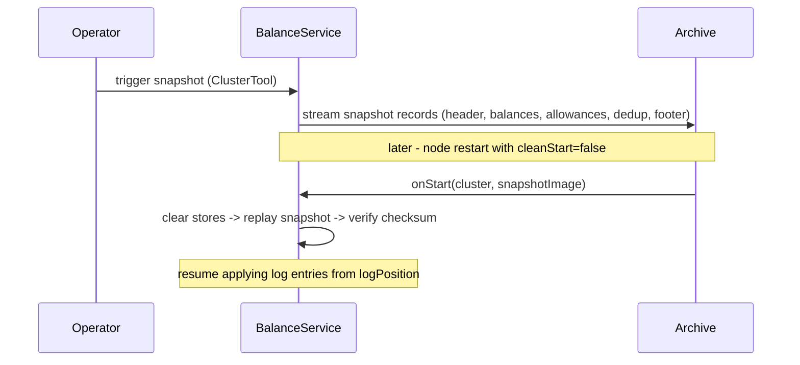

# ADBE Operations Guide

This guide covers cluster deployment, snapshot management, node recovery, capacity tuning, and
observability for ADBE operators and SREs. For the client integration surface see
[API-REFERENCE.md](API-REFERENCE.md). For system internals see [ARCHITECTURE.md](ARCHITECTURE.md).

---

## Table of Contents

1. [JVM Requirements](#1-jvm-requirements)
2. [Running a Single Node](#2-running-a-single-node)
3. [Running a Multi-Node Cluster](#3-running-a-multi-node-cluster)
4. [Snapshot Management](#4-snapshot-management)
5. [Node Restart and Recovery](#5-node-restart-and-recovery)
6. [CoreConfig Capacity Reference](#6-coreconfig-capacity-reference)
7. [Prometheus Metrics](#7-prometheus-metrics)
8. [Read Service (HTTP Query API)](#8-read-service-http-query-api)

---

## 1. JVM Requirements

Aeron and Agrona require the following JVM flags. Add them to `JAVA_TOOL_OPTIONS` or the launcher
command line:

```bash
--add-opens java.base/jdk.internal.misc=ALL-UNNAMED
--add-opens java.base/sun.nio.ch=ALL-UNNAMED
```

These are already wired in the Gradle `jvmArgs` block and in the Docker images. Manual deployments
must set them explicitly.

**Recommended GC** for production:

| Workload                                       | GC strategy                  |
|------------------------------------------------|------------------------------|
| General low-latency (default)                  | ZGC or Shenandoah            |
| Zero-GC operational window (trading sessions)  | Epsilon GC + sized heap      |
| Non-critical / monitoring nodes                | G1                           |

---

## 2. Running a Single Node

### Gradle (development / CI)

```bash
# Fresh single-node cluster; state cleared on each start.
./gradlew :adbe-launcher:run

# Preserve state across restarts.
./gradlew :adbe-launcher:run -Dadbe.nodeId=0 -Dadbe.cleanStart=false

# Custom base directory.
./gradlew :adbe-launcher:run -Dadbe.baseDir=/var/adbe/node-0

# Expose Prometheus metrics on port 9100.
./gradlew :adbe-launcher:run -Dadbe.metricsPort=9100
```

### Properties file (production)

```bash
./gradlew :adbe-launcher:run --args="--config=production.properties"
# or
java -jar adbe-launcher.jar --config=production.properties
```

Recognised properties:

| Key                  | Required | Default                          | Description                                    |
|----------------------|:--------:|----------------------------------|------------------------------------------------|
| `adbe.clusterMembers`| yes      | -                                | Aeron member string (see Section 3).           |
| `adbe.baseDir`       | no       | `build/adbe-node-<id>`           | Root directory for archive and cluster state.  |
| `adbe.host`          | no       | `localhost`                      | This node's advertised host for ingress.       |

Node id is supplied via `adbe.nodeId` system property or defaults to `0`.

---

## 3. Running a Multi-Node Cluster

### Aeron member string format

Each node in `adbe.clusterMembers` has six comma-separated fields:

```
<id>,<ingress>,<consensus>,<log>,<catchup>,<archive>
```

For a three-node cluster on `localhost` (ports follow `PORT_BASE=20100`, `PORT_STRIDE=100`):

```
0,localhost:20100,localhost:20101,localhost:20102,localhost:20103,localhost:20104|1,localhost:20200,...|2,localhost:20300,...
```

### Local three-node cluster (Gradle)

```bash
# Terminal 0
./gradlew :adbe-launcher:run -Dadbe.nodeId=0 -Dadbe.config=local-3node.properties

# Terminal 1
./gradlew :adbe-launcher:run -Dadbe.nodeId=1 -Dadbe.config=local-3node.properties

# Terminal 2
./gradlew :adbe-launcher:run -Dadbe.nodeId=2 -Dadbe.config=local-3node.properties
```

All three nodes share the same `adbe.clusterMembers` string in `local-3node.properties`; each
supplies its own `adbe.nodeId` on the command line.

### Docker Compose

```bash
# Start three-node cluster.
docker compose up --build

# Run smoke-test client against the live cluster.
docker compose run --rm client
```

Node 0 exposes ingress port `20100/udp` to the host. Prometheus endpoints are available at
`localhost:9100`, `localhost:9101`, `localhost:9102`.

The `ADBE_INGRESS_ENDPOINTS` and `ADBE_EGRESS_ENDPOINT` environment variables in the compose file
configure which host the client connects to and which address it advertises for egress delivery.

---

## 4. Snapshot Management

### What is snapshotted

Every snapshot includes balances, allowances, and the full dedup table. This means idempotency
guarantees survive a restart: a node restarted from snapshot returns `DUPLICATE` for any command
already applied before the snapshot was taken.

### Triggering a snapshot

Snapshots are requested via the Aeron `ClusterTool`. The consensus module routes the request
through the Raft log so every node takes the snapshot at the same log position, producing
byte-identical output.

```bash
# clusterDir is the node's cluster state directory (adbe.baseDir/cluster by default).
java -cp aeron-all.jar io.aeron.cluster.ClusterTool \
    build/adbe-node-0/cluster \
    snapshot
```

Take snapshots during low-load windows. The `onTakeSnapshot` callback runs on the single
`ClusteredServiceAgent` thread; it does not block command processing but does consume agent time
while streaming records.

### Snapshot record order

Records are written one at a time into a 64-byte reusable buffer. Keys are sorted within each
section so any two healthy nodes produce byte-identical snapshots.

```
[SnapshotHeader]    logPosition, schemaVersion, balanceCount, allowanceCount,
                    dedupCount, totalSupply
[BalanceEntry...]   ascending by accountId
[AllowanceEntry..] ascending by (ownerId, delegateId)
[DedupEntry...]     ascending by (clientId, clientSeq)
[SnapshotFooter]    checksum = sum(all balances) - must equal totalSupply
```

**Integrity check**: `SnapshotManager.verifyInvariant()` confirms `sum(balances) == totalSupply`
after load. A mismatch indicates snapshot corruption.

---

## 5. Node Restart and Recovery

### cleanStart flag

| `cleanStart` | Behaviour                                                                 |
|:------------:|---------------------------------------------------------------------------|
| `true` (default) | Deletes prior archive and cluster directories; starts a fresh cluster. |
| `false`          | Preserves directories; recovers from the latest snapshot, then replays the remaining log. |

```bash
# Preserve and recover.
./gradlew :adbe-launcher:run -Dadbe.nodeId=0 -Dadbe.cleanStart=false

# Programmatically.
ClusterNode node = new ClusterNode(clusterConfig, CoreConfig.defaults(), /*cleanStart=*/ false);
```

### Recovery flow



### What survives restart

| State                              | Persisted | Detail                                                            |
|------------------------------------|:---------:|-------------------------------------------------------------------|
| Account balances                   | yes       | All accounts and their exact balances.                            |
| Allowances                         | yes       | All (owner, delegate, allowance) triples.                         |
| Dedup table                        | yes       | Cached results within the dedup window. Idempotency holds.        |
| Pending in-flight commands (client)| no        | `AdbeClient` retransmits automatically via `onNewLeader` callback.|

---

## 6. CoreConfig Capacity Reference

All capacities are pre-allocated at node start, validated as power-of-two, and never grow during
operation. Size them for peak steady-state; over-sizing wastes memory, under-sizing causes
`IllegalArgumentException` at startup.

| Setting                   | Default  | Computed default  | Purpose                                               |
|---------------------------|----------|-------------------|-------------------------------------------------------|
| `accountCapacity`         | `1 << 20`| 1 048 576         | Balance-map slots. One slot per distinct account id.  |
| `allowanceOwnerCapacity`  | `1 << 16`| 65 536            | Distinct allowance owners.                            |
| `delegateCapacity`        | `1 << 4` | 16                | Delegate slots per owner.                             |
| `dedupClientCapacity`     | `1 << 16`| 65 536            | Distinct client ids tracked by the dedup table.       |
| `dedupWindow`             | `1 << 10`| 1 024             | Most recent commands retained per client (ring size). |

**Tuning rules**:
- All values must be powers of two. `CoreConfig.of(...)` validates at construction.
- `accountCapacity` should exceed expected peak distinct accounts by at least 30 % to keep the
  Agrona `Long2LongHashMap` load factor below `0.6`.
- `dedupWindow` determines how many commands per client survive a retransmit window. Size it to
  cover `maxRetries * retryBackoffNs` at your peak submit rate.

Custom capacities:

```java
// e.g. smaller footprint for a development / test node.
CoreConfig config = CoreConfig.of(
        1 << 16,  // accountCapacity
        1 << 12,  // allowanceOwnerCapacity
        1 << 4,   // delegateCapacity
        1 << 12,  // dedupClientCapacity
        1 << 8);  // dedupWindow
```

---

## 7. Prometheus Metrics

Enable the HTTP endpoint with `-Dadbe.metricsPort=<port>`. The server binds `0.0.0.0:<port>` on a
daemon thread and reads off-heap counters with acquire ordering, never touching the service thread.

```bash
./gradlew :adbe-launcher:run -Dadbe.metricsPort=9100
curl http://localhost:9100/metrics
curl http://localhost:9100/healthz   # returns "ok"
```

### Counter metrics (monotonic)

| Metric name                    | Description                                                        |
|--------------------------------|--------------------------------------------------------------------|
| `adbe_commands_processed`      | Total commands applied (excluding duplicates).                     |
| `adbe_duplicates_detected`     | Commands returned from dedup cache without re-applying.            |
| `adbe_insufficient_balance`    | Commands rejected with `INSUFFICIENT_BALANCE`.                     |
| `adbe_insufficient_allowance`  | Commands rejected with `INSUFFICIENT_ALLOWANCE`.                   |
| `adbe_invalid_account`         | Commands rejected with `INVALID_ACCOUNT`.                          |
| `adbe_overflow`                | Commands rejected with `OVERFLOW`.                                 |
| `adbe_invalid_amount`          | Commands rejected with `INVALID_AMOUNT`.                           |
| `adbe_backpressure_events`     | Egress back-pressure events on the service thread.                 |
| `adbe_leader_elections`        | Leader elections observed by this node since start.                |

### Gauge metrics (current value)

| Metric name                    | Description                                                        |
|--------------------------------|--------------------------------------------------------------------|
| `adbe_snapshot_write_nanos`    | Duration of the last snapshot write in nanoseconds.                |
| `adbe_snapshot_read_nanos`     | Duration of the last snapshot load in nanoseconds.                 |
| `adbe_balance_count`           | Current number of distinct accounts in the balance map.            |
| `adbe_allowance_owner_count`   | Current number of distinct allowance owners.                       |
| `adbe_dedup_client_count`      | Current number of distinct clients tracked by the dedup table.     |

### Prometheus scrape config example

```yaml
scrape_configs:
  - job_name: adbe
    static_configs:
      - targets:
          - adbe-node-0:9100
          - adbe-node-1:9101
          - adbe-node-2:9102
```

### Alerting recommendations

- **`adbe_commands_processed` growth rate drops to zero**: cluster has stalled; check leader
  election and ingress connectivity.
- **`adbe_backpressure_events` rising**: egress channel to a client is slow; check client-side
  `poll()` rate and network.
- **`adbe_balance_count` approaching `accountCapacity`**: resize before the map load factor
  degrades; plan a rolling restart with a larger `CoreConfig`.
- **`adbe_snapshot_write_nanos` suddenly large**: snapshot took longer than expected; check I/O on
  the archive directory.

---

## 8. Read Service (HTTP Query API)

The read service (`adbe-read`) serves eventually-consistent balance, allowance,
and total-supply reads over HTTP. Two deployment modes are supported:

- **Standby mode** (`ADBE_MODE=standby`, default): `StandbyReadNode` runs as a
  standalone process, independent of the Raft cluster. It connects to the
  write cluster's Aeron Archive, periodically downloads the latest service
  snapshot, and serves reads from the loaded state. Optionally, with live log
  following enabled (`ADBE_LIVE_LOG=true`, default), it subscribes to the
  consensus log recording for sub-second staleness. See ADR 0006.

- **Cluster mode** (`ADBE_MODE=cluster`, legacy): `ReadModelService` runs as a
  full Raft voting member, applying the identical committed log. All members
  in the cluster must host the identical service. See ADR 0005.

### Running a standby read node

```bash
# Gradle (development): standalone standby, connects to localhost:20104 archive.
ADBE_ARCHIVE_CHANNEL=aeron:udp?endpoint=localhost:20104 ./gradlew :adbe-read:run

# Standalone process with live log following.
java \
    --add-opens java.base/jdk.internal.misc=ALL-UNNAMED \
    --add-opens java.base/sun.nio.ch=ALL-UNNAMED \
    -cp 'adbe-read/build/libs/*' com.adbe.read.ReadServiceLauncher
```

Recognised environment variables (standby mode):

| Variable                 | Required | Default                               | Description                                           |
|--------------------------|:--------:|---------------------------------------|-------------------------------------------------------|
| `ADBE_MODE`              | no       | `standby`                             | `standby` or `cluster`.                               |
| `ADBE_ARCHIVE_CHANNEL`   | yes      | `aeron:udp?endpoint=localhost:20104`  | Cluster member's Archive control channel.             |
| `ADBE_HTTP_PORT`         | no       | `8080`                                | Port for the HTTP query API.                          |
| `ADBE_SNAPSHOT_POLL_MS`  | no       | `5000`                                | Interval (ms) between snapshot polls on the Archive.  |
| `ADBE_LIVE_LOG`          | no       | `true`                                | Enable live log following for sub-second staleness.   |

Recognised environment variables (cluster mode):

| Variable               | Required | Default                 | Description                                        |
|------------------------|:--------:|-------------------------|----------------------------------------------------|
| `ADBE_MODE`            | no       | `standby`               | Set to `cluster` for legacy mode.                  |
| `ADBE_NODE_ID`         | yes      | `0`                     | This member's cluster id.                          |
| `ADBE_CLUSTER_MEMBERS` | yes      | single-node localhost   | Aeron member string (see Section 3).               |
| `ADBE_HOST`            | yes      | `localhost`             | This node's advertised host.                       |
| `ADBE_BASE_DIR`        | no       | `build/adbe-read-node`  | Root directory for archive and cluster state.      |
| `ADBE_HTTP_PORT`       | no       | `8080`                  | Port for the HTTP query API.                        |
| `ADBE_CLEAN_START`     | no       | `true`                  | Wipe prior archive and cluster state on start.     |

### Consistency and health

- **Standby mode**: Reads are eventually consistent. Without live log following,
  staleness is bounded by `snapshotInterval + pollInterval`. With live log
  following, staleness is the live log replay delay (milliseconds).
- **Cluster mode**: Reads reflect the follower's applied log position, trailing
  the leader by replication latency.
- Liveness probe: `GET /healthz` returns `{"status":"ok"}`.
- Gateway counters: `GET /metrics` returns `submitted`, `completed`, `pending`,
  `overloads`, and `orphanResponses` as JSON.

### Deployment models

**Recommended: Standby nodes alongside write cluster**

```bash
# Terminal 1: start the write cluster (3 voting members).
docker compose up --build

# Terminal 2: start 3 standby read nodes connecting to the write cluster.
docker compose -f docker-compose.read.yml up --build

# Write via AdbeClient to localhost:20100.
# Read from any standby:
curl http://localhost:8080/balance/100
curl http://localhost:8081/supply
curl http://localhost:8082/healthz
```

Standby nodes are NOT cluster members: they do not vote, do not affect quorum,
and can be added, removed, or restarted independently.

**Legacy: Homogeneous read cluster**

```bash
# All 3 nodes host ReadModelService (voting members, affects quorum).
ADBE_MODE=cluster docker compose -f docker-compose.read.yml up --build
```

Note: when `ADBE_MODE=cluster`, the docker-compose.read.yml uses the legacy
topology. Override `ADBE_CLUSTER_MEMBERS` as needed.
