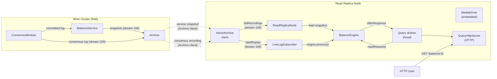
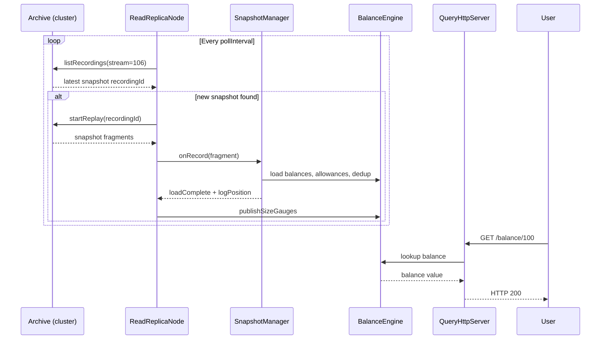
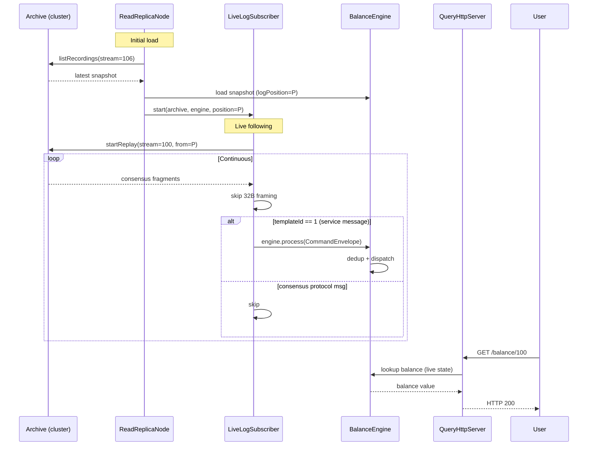

# 0006 - Read Replica Nodes: External Replication via Aeron Archive

Status: Accepted
Date: 2026-07-30
Updated: 2026-07-30 (Phase 2: live log following)
Updated: 2026-08-01 (ADR 0007: cluster mode removed; live log follows from position 0; routable Archive call-back host)
Updated: 2026-08-01 (terminology: renamed "read replica" to "read replica" - the node is a read-only replica, not a failover read replica)

## Context

ADR 0005 introduced the read-side CQRS model where `ReadModelService` joins the
cluster as a follower and applies the identical committed log. Phase 1 shipped
this as a full Raft voting member: all nodes in `clusterMembers` participate in
leader election and count toward quorum. This means every read node increases
the quorum threshold, so losing read nodes can bring the entire cluster down.

The natural solution -- passive (non-voting) cluster members -- was investigated
and found to be unavailable in Aeron 1.48.0. The `ConsensusModule.Context`
class has no `isPassive` method, and Aeron explicitly removed passive member
references in version 1.49.0. Dynamic join and passive membership are not part
of the Aeron Cluster roadmap.

The requirement is: read nodes must receive cluster state and serve reads
without affecting Raft quorum, leader election, or write availability.

## Decision

Read nodes will be **standalone processes** that replicate state through the
Aeron Archive instead of participating in the Raft consensus protocol.
Specifically:

1. **Snapshot-based replication (Phase 1)**: Each read replica node connects to a
   cluster member's Aeron Archive as a client (not a cluster member). It
   periodically polls the Archive for the latest service snapshot recording,
   replays the snapshot through the same deterministic `BalanceEngine`, and
   serves reads from the loaded state.

2. **Live log following (Phase 2)**: After loading a snapshot, the read replica node
   subscribes to the consensus module's log recording (stream 100) on the
   Archive, starting from the snapshot's log position. It parses the consensus
   framing (32 bytes: cluster MessageHeader + SessionMessageHeader) to extract
   service messages, and feeds each `CommandEnvelope` to the engine in real time.
   This reduces write-to-read latency from the snapshot interval to the live
   log replay delay (milliseconds).

3. **No consensus participation**: Read replica nodes are not listed in
   `clusterMembers`. They run no `ConsensusModule`, no `ClusteredService`,
   no Raft state machine. They are purely external consumers of the Archive's
   recording catalog.

4. **Bounded staleness (Phase 1)**: Without live log following, reads reflect
   the most recent snapshot on the Archive. Staleness is worst-case
   `snapshotInterval + pollInterval` -- configurable but typically a few seconds.

5. **Sub-second staleness (Phase 2)**: With live log following enabled, the
   engine state is updated continuously from the consensus recording. Write to
   read latency is the live log replay delay (microseconds to low
   milliseconds), comparable to a cluster follower.

6. **New launcher mode**: `ReadServiceLauncher` gains an `ADBE_MODE=read-replica`
   mode (the default for read deployments). The legacy `ADBE_MODE=cluster` mode
   is preserved for homogeneous read clusters when that topology is preferred.

### Architecture (Phase 2)

### Data Flow: Phase 1 (snapshot-only)

### Data Flow: Phase 2 (snapshot + live log)

### Latency comparison

| | Phase 1 (snapshot-only) | Phase 2 (snapshot + live log) | Cluster member |
|---|---|---|---|
| **Mechanism** | Poll snapshot periodically | Snapshot + subscribe consensus recording | Raft log replication |
| **Between snapshots** | State frozen | State updated continuously | State updated continuously |
| **Latency per write** | 0 ~ 10s | **~1-10ms** | ~1ms |
| **Quorum impact** | None | None | Increases N |
| **Scale** | Unlimited | Unlimited | Limited by quorum |

## Consequences

- **Positive**: Read nodes no longer affect quorum. They can be added, removed,
  or restarted independently. Write availability is decoupled from read scaling.
- **Positive**: The deterministic core (`adbe-core`) is unchanged. All consensus
  and snapshot logic is reused unmodified.
- **Positive**: With live log following (Phase 2), read latency is comparable to
  a cluster follower (milliseconds), not bounded by the snapshot interval.
- **Positive**: Zero new dependencies. `ReadReplicaNode` uses only Aeron Archive
  client APIs and Aeron Cluster codecs already present in the project.
- **Negative**: Reads are eventually consistent with bounded staleness
  (live log replay delay in Phase 2, snapshot interval in Phase 1 only), not
  linearizable. This is acceptable per ADR 0005.
- **Negative**: Each read replica node runs its own embedded Media Driver, consuming
  additional memory and CPU compared to a cluster member sharing the driver.
- **Negative**: `LiveLogSubscriber` relies on the cluster Archive keeping the
  consensus recording available. If the recording is pruned before the read replica
  catches up, the read replica must fall back to a fresh snapshot load.

## Out of scope

- Automatic snapshot triggering from the read replica side.
- Multi-archive failover (read replica currently connects to a single archive
  endpoint; retry across members is deferred).
- Authentication or encryption on the Archive connection.
