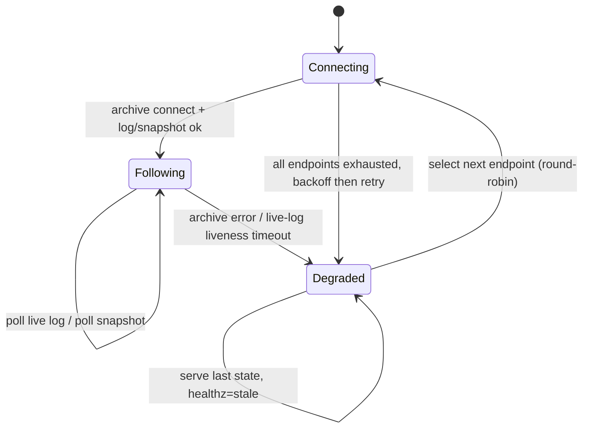
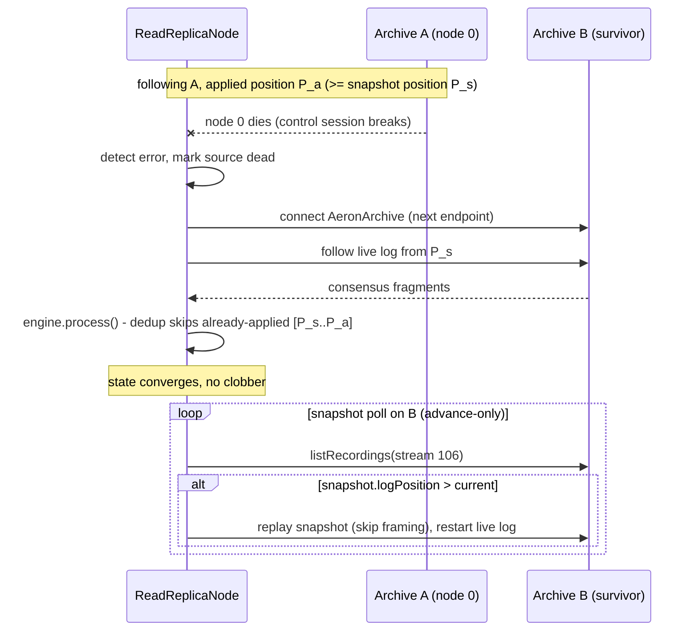

# 0008 - Read Node HA: Multi-Archive Failover

Status: Accepted
Date: 2026-08-02

## Context

ADR 0006 made read replica nodes standalone processes that replicate state
through a cluster member's Aeron Archive instead of joining Raft, so they never
affect quorum. ADR 0007 standardized on that single topology. Both ADRs
explicitly deferred multi-archive failover: a read replica connects to ONE
statically configured Archive endpoint (`LEDGERD_ARCHIVE_CHANNEL`, hard-wired to
node 0 in the Docker topology) and `ReadReplicaNode` opens that connection once
in its constructor with no reconnection logic.

The dependency is therefore on a single pinned member's Archive, not on the
Raft leader role (a leader change that leaves node 0 alive does not disturb the
read replica). The failure modes are:

- **F1 - source node dies.** When node 0 crashes, the `AeronArchive` control
  session breaks. The agent loop catches the per-cycle snapshot-poll exception
  and the live-log replay simply stops delivering, so the read replica keeps
  serving a FROZEN state forever, until its process is restarted.
- **F2 - network partition** between the read replica and node 0: same as F1.
- **F3 - log pruning.** If node 0's Archive prunes the consensus recording
  before the replica catches up, ADR 0006 says the replica must fall back to a
  fresh snapshot - but with a single source there is nothing to fall back to.

The read verification script never kills node 0, so this was unexercised. The
acceptance test `ReadReplicaArchiveFailoverFaultTest` (tagged `fault`) proves
the gap: with the read replica pinned to node 0 and the live log enabled,
killing node 0 leaves the write cluster committing (quorum 2 of 3) while the
read replica stays frozen at the pre-kill supply.

### Phase 0 evidence

`ReadReplicaArchiveModelClusterTest` (tagged `cluster`) boots a 3-node cluster,
triggers a snapshot, and inspects every member's Archive. It confirms the model
this design relies on:

- **(A)** Every member records the committed consensus log (stream 100) to its
  own Archive, so live-log following works from ANY member, not just the pinned
  one. This is the core enabler: failover needs no leader discovery.
- **(B)** The leader holds a valid LEDGERD service snapshot at a real log position.
- **(C)** Followers ALSO carry a service snapshot, and its `logPosition` is
  EQUAL across all members (observed 672 on leader and both followers). The
  snapshot `logPosition` is written from `cluster.logPosition()`, so it is
  cluster-global and comparable across Archives even though recording ids are
  per-Archive and not comparable.

### Snapshot stream layout (corrected understanding)

The same investigation corrected an inaccuracy in ADR 0006, which stated a
snapshot trigger produces two recordings on the snapshot stream. The actual
layout, verified by replaying the recordings:

- The LEDGERD **service snapshot** is on **stream 106**, prefixed with three
  cluster-schema framing records (schema 111) before the LEDGERD `SnapshotHeader`
  (LEDGERD schema, template 10), then the balance / allowance / dedup / footer
  records.
- The **consensus-module snapshot** is a separate, all-cluster-schema recording
  on **stream 107**.

The read replica's snapshot loader only inspected the FIRST record and rejected
the recording when it was not the `SnapshotHeader`. Because the service snapshot
is framing-prefixed, the loader rejected it; a `snapshotRejected` flag was set
but did not stop the fragment handler, so small snapshots (fewer records than
the 64-fragment poll batch) loaded by accident while large snapshots loaded only
their first batch - leaving `totalSupply` set from the header but most balances
absent, violating the `sum(balances) == totalSupply` invariant. This was fixed
as a prerequisite of this ADR: the loader now skips the cluster-schema framing,
begins the load at the `SnapshotHeader`, and polls until the snapshot is
complete (`ReadReplicaSnapshotLoadClusterTest`, 100 accounts, is the regression
test). Correct snapshot loading is required for the advance-only snapshot step
below to mean anything.

## Decision

The read replica accepts MULTIPLE Archive endpoints (one per cluster member) and
fails over between them, so the loss of any single member's Archive no longer
freezes reads.

1. **Multi-endpoint configuration.** `ReadReplicaConfig` takes an ordered list
   of Archive control channels (env `LEDGERD_ARCHIVE_CHANNELS`, comma-separated),
   staying backward compatible with the single `LEDGERD_ARCHIVE_CHANNEL`. The
   Docker read service is configured with all three member Archive endpoints
   (`ledgerd-node-0:20104`, `ledgerd-node-1:20204`, `ledgerd-node-2:20304`).

2. **Failover, not leader-following.** No leader discovery is performed. By
   Phase 0 fact (A) every member's Archive has the committed log, so the replica
   simply uses the first reachable endpoint and, on failure, moves to the next
   (round-robin with backoff). An `ArchiveSource` owns the `AeronArchive` client
   for the active endpoint and reconnects; the single-writer agent detects a
   dead source via Archive errors (control-session failure, `listRecordings` /
   `startReplay` throwing) and a live-log liveness timeout.

3. **Tier-1 convergence via the live log + dedup.** On switching to a new source
   the replica keeps its engine state and re-points the live-log subscription at
   the new Archive from its last loaded snapshot position. The engine's
   command-id dedup makes re-applying the already-seen prefix idempotent, so
   state stays correct with no clobber. This is the primary path and depends
   only on fact (A).

4. **Advance-only snapshot loading.** Snapshot polling on the new source loads a
   service snapshot (stream 106, skipping the framing) only when its
   cluster-global `logPosition` ADVANCES the replica's current position; older
   snapshots are skipped. Because `logPosition` is cluster-global (fact C), the
   comparison is valid across Archives even though recording ids are not. When a
   snapshot is loaded the live log restarts from the snapshot position.

5. **Observability.** `/healthz` reflects replication health (ok / stale with
   the applied log position and the active endpoint) instead of always returning
   ok, and a failover counter is exposed via `/metrics`, so an orchestrator or
   load balancer can detect a degraded replica.

## Consequences

- **Positive**: The read replica survives the loss of any single member's
  Archive (F1, F2) and can fall back to another member's snapshot (F3). Reads
  keep converging instead of freezing.
- **Positive**: The replica is decoupled from any particular member and from the
  leader role; it follows whichever member's Archive is reachable. It remains a
  non-member with no quorum impact (ADR 0006/0007 unchanged).
- **Positive**: The design rests on proven invariants (Phase 0): the log is on
  every member and the snapshot position is cluster-global. No leader discovery
  or new dependency is required.
- **Positive**: The prerequisite snapshot-loader fix restores correct snapshot
  loading (and the `sum(balances) == totalSupply` invariant) for all topologies,
  bounded by snapshots instead of always replaying the log from position 0.
- **Negative**: During a failover the replica re-applies up to one
  snapshot-interval of already-seen commands (idempotent, brief CPU cost); if the
  new source's latest snapshot is older than the current state, reads can lag
  until the live log catches up. Bounded staleness (ADR 0005) still holds.
- **Negative**: Each source change re-runs snapshot discovery against the new
  Archive, and the replica carries more configuration (a list of endpoints).
- **Negative**: A silently dead Archive (no exception, just no fragments) is only
  detected via a liveness timeout, which adds a detection delay before failover.

## Out of scope

- **Read-tier HA**: running multiple read replicas behind a load balancer is
  orthogonal (it scales/protects the read tier itself) and builds on this ADR's
  health signal; deferred.
- **Prefer-leader Archive**: biasing toward the leader's Archive for the lowest
  staleness requires leader discovery; the bounded-staleness contract makes this
  unnecessary for now.
- Triggering snapshots from the read replica side.
- Authentication or encryption on the Archive connection.
