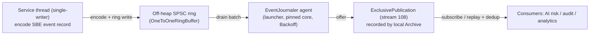

# 0011 - Domain Event Journal

Status: Accepted
Date: 2026-08-06

## Context

The core emits exactly one `CommandResult` (an ACK) per command to the
submitting session. That is enough for the Edge client, and the read replica
rebuilds full query state by re-executing the committed command log. Neither
produces a clean, decoupled stream of *semantic facts* ("account A was debited
100, new balance 400", "A transferred 150 to B") that a fan-out of consumers -
AI risk, audit, analytics, external integrations - can subscribe to without
re-implementing the engine.

Re-executing commands on every consumer (as the read replica does) is the wrong
substrate for that fan-out:

- Each consumer becomes a full engine copy (balance + allowance + dedup + snapshot
  load) even when it only needs "transfer velocity per account".
- Consumers are pinned to the exact business-logic version of the leader, so an
  engine change silently drifts downstream state.
- Values known only at apply-time (resulting balance, sequence, leader timestamp)
  are re-derived elsewhere, risking divergence.

The AI substrate (roadmap month 3-6) is the first multi-consumer workload, so the
journal is now justified. See tmp/ROADMAP.md sections 3.2-3.4.

## Decision

The core emits a durable, deterministic stream of semantic domain events on a
dedicated egress path, off the consensus hot path.

1. **Schema (adbe-protocol, schema version 2 -> 3, additive).** New SBE flyweight
   messages, one template per event kind (templateIds 20-26): `BalanceChangedEvent`,
   `ReservedEvent`, `CapturedEvent`, `ReleasedEvent`, `TransferEvent`,
   `AllowanceChangedEvent`, `CommandRejectedEvent`, plus an `EventCause` enum.
   Every event opens with the same fixed prefix - `logPosition` (uint64),
   `timestamp` (int64), `eventIndex` (uint16) - so a consumer can peek the dedup
   key uniformly before dispatching on templateId. Each framed message is
   <= 64 bytes (one cache line); the largest, `BalanceChangedEvent`, is 59 bytes.
   `TransferEvent` carries no balances (kept <= 64B); a `TRANSFER` emits two
   `BalanceChangedEvent` records (debit and credit side) plus one `TransferEvent`
   for the graph edge, ordered by `eventIndex` and joined by shared `logPosition`.

2. **Deterministic event sequence.** The dedup / ordering key is
   `(logPosition, eventIndex)`, where `logPosition` is the cluster-global
   `cluster.logPosition()` at apply-time and `eventIndex` is the 0-based index of
   the event within that command. This is a pure function of the replicated log,
   so it is identical on every member.

3. **Allocation-free hot-path emission.** Handlers record the semantic events they
   produce into the reused `CommandOutcome` (a fixed-capacity, preallocated
   descriptor array). After `engine.process`, `BalanceService` encodes each
   descriptor as an SBE flyweight into a preallocated buffer and writes it to an
   off-heap single-producer / single-consumer ring (Agrona `OneToOneRingBuffer`).
   The hot-path cost is a bounded encode plus one ring write per event; no I/O, no
   allocation, no lock. Rejected commands emit a single `CommandRejectedEvent` from
   the decoded envelope and the outcome status. Duplicates (dedup hits) emit
   nothing - the fact already happened.

4. **Journaler agent, off the consensus thread.** A dedicated Agrona `Agent`
   (pinned core, `BackoffIdleStrategy`), owned by the launcher (not the
   determinism-gated core), drains the ring in batches and offers each record to
   an `ExclusivePublication` recorded by the local Archive on a new stream id
   (108). The Aeron I/O therefore never runs on the single-writer consensus thread.

5. **Per-member recording + consumer dedup (reuse ADR 0008 fact A).** Every member
   records its own event stream to its own Archive, exactly as it records the
   consensus log. A consumer follows the first reachable member and, on failure,
   fails over to the next (round-robin, the `ArchiveSource` pattern), deduplicating
   by `(logPosition, eventIndex)` so a re-followed prefix is idempotent. No leader
   discovery is required.

6. **Opt-in.** Journaling is a `CoreConfig` flag (`eventJournalEnabled`), default
   off. When disabled, the hot path skips emission entirely (one predicted branch),
   so the read replica and tests that do not need the journal pay nothing.

## Consequences

- The core gains a second egress path but the consensus hot path keeps its budget:
  emission is a bounded encode plus a ring write, verified allocation-free by JMH
  `-prof gc`. Publish stays under the 80 ns ring-publish budget (ADR 0002).
- Events are self-contained facts carrying apply-time values, so consumers can be
  stateless or hold only a sliding window; they are decoupled from the engine's
  business-logic version.
- The event stream is deterministic and replayable: a recorded session replays to a
  byte-identical event stream, which is a release gate (see Testing).
- Snapshots are unaffected: the journal is derived output, not authoritative state.
  A consumer that starts mid-stream begins from the first available event; it does
  not need a snapshot of the journal.

### Follow-up: a true ingress-backpressure contract (deferred)

For this phase the ring is sized for the worst-case burst and, on ring-full, the
service thread records to `DistinctErrorLog` and increments an off-heap counter -
it never drops silently and never spins on the consensus thread (the journaler is
a separate thread). This is adequate for the AI risk PoC but is NOT a durable-audit
guarantee: a sustained journaler stall can still overflow the ring.

A future revision must make the journal lossless under sustained backpressure by
propagating ring-full back to cluster ingress (reject / throttle new commands)
rather than overflowing, so audit consumers can trust completeness. That contract
is out of scope here and tracked as the successor to this ADR.

## Testing

- Unit: SBE encode / decode round-trip for every event template; `(logPosition,
  eventIndex)` prefix decodes uniformly across templates.
- Unit: one `TRANSFER` produces exactly three correlated records in
  `eventIndex` order, and the paired `BalanceChangedEvent` deltas net to zero
  (supply conservation at the event layer).
- Integration: emitted events are recorded to the member Archive and replay in
  order.
- Replay determinism: a recorded command session replays to a byte-identical event
  stream.
- JMH: the event publish path stays within budget and is allocation-free
  (`-prof gc`).
