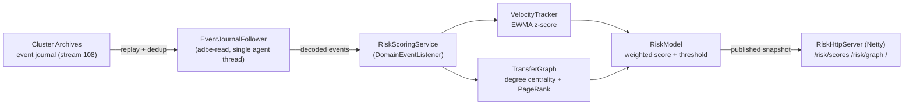

# 0012 - AI Risk Substrate

Status: Accepted
Date: 2026-08-06

## Context

ADR 0011 gives the platform a durable, deterministic stream of semantic domain
events (balance changes, transfers, holds, allowance changes, rejects) that any
number of consumers can follow off the consensus hot path. The AI substrate
(roadmap month 3-6, sections 3.2-3.4) is the first such consumer and the reason
the journal was justified.

The goal of this phase is a proof of concept, not a production fraud engine: show
that a decoupled consumer can turn the event stream into live risk signals
(transaction velocity anomalies and money-flow graph structure) and surface them
on a dashboard, without re-implementing the engine and without perturbing the
deterministic core.

## Decision

A new Edge module `adbe-risk` consumes the event journal and scores accounts in
real time.

1. **Bounded context: Edge, not core.** `adbe-risk` is a read-side / Edge module
   like `adbe-read`. It may use the system clock, heap allocation, `HashMap`,
   streams, and Netty. It MUST NOT link the deterministic core hot path and MUST
   NOT join Raft or affect quorum. It only reads.

2. **Consumes the journal via `adbe-read`.** It follows the recorded event stream
   (ADR 0011, stream 108) with `EventJournalFollower` and a
   `DomainEventListener`, reusing the multi-archive failover and
   `(logPosition, eventIndex)` dedup already built for Phase 2. No new transport
   or subscriber is introduced.

3. **Single-writer feature state.** The follower delivers every event on one agent
   thread, so `RiskScoringService` (the `DomainEventListener`) owns all feature
   state and updates it single-threaded, with no locks. The HTTP dashboard thread
   only reads published snapshots, so the exposed values use
   `ConcurrentHashMap` + volatile publication; a dashboard read never blocks or
   perturbs the follower.

4. **Features (PoC set).**
   - `VelocityTracker`: per-account transaction velocity as an exponentially
     weighted moving average of the instantaneous rate, plus an exponentially
     weighted variance, yielding a live z-score of the newest transaction against
     the account's own baseline. Keyed by account id.
   - `TransferGraph`: an incremental money-flow adjacency built from
     `TransferEvent` edges. Degree centrality (in + out) is maintained live;
     PageRank is computed on demand over a copied snapshot so the scoring thread
     is never blocked by an iterative pass.

5. **Model (PoC baseline).** `RiskModel` combines the velocity z-score and the
   graph centrality into a single bounded risk score with configurable weights and
   a flag threshold. A gradient-boosting model is an explicit stretch goal (see
   Consequences) and is out of scope for the first cut; the z-score + centrality
   baseline is enough to demonstrate the substrate end to end.

6. **Dashboard.** A Netty HTTP boundary (`RiskHttpServer`, mirroring
   `adbe-read`'s `QueryHttpServer`) serves a static dashboard plus JSON:
   `GET /` (HTML + JS heatmap and transfer-graph view), `GET /risk/scores`,
   `GET /risk/graph`, `GET /healthz`, `GET /metrics`. JSON is built by hand at the
   Edge, never on the follower thread.

7. **Entry point + config.** `RiskServiceLauncher` reads environment variables
   with localhost defaults, exactly as `ReadServiceLauncher` /
   `EventJournalVerifier` do (`ADBE_ARCHIVE_CHANNELS` / `ADBE_ARCHIVE_CHANNEL`,
   `ADBE_LOCAL_HOST`, `ADBE_AERON_DIR`, `ADBE_HTTP_PORT`).

## Consequences

- The platform demonstrates the fan-out value of the journal: a non-trivial
  analytics consumer runs with zero changes to the deterministic core and zero
  effect on quorum or latency.
- Feature state lives only in the risk process. It is derived output, not
  authoritative state; a restart rebuilds it by re-following from the first
  available event (the follower already carries the dedup high-water mark within a
  run). Persistence / snapshotting of feature state is out of scope for the PoC.
- The scoring is a heuristic baseline. Accuracy is not a goal of this ADR; the
  substrate is. A gradient-boosting model (pure-Java, e.g. Smile) trained on
  labelled history is the natural follow-up and slots in behind the `RiskModel`
  interface without touching the feature or transport layers.
- Because the module is Edge, its code is exempt from the core determinism rules
  but still passes the standard gate (spotless, checkstyle, `-Werror`, tests).

## Testing

- Unit: `VelocityTracker` z-score rises for a burst and decays back to baseline;
  `TransferGraph` degree centrality and PageRank on a small hand-checked graph;
  `RiskModel` monotonicity and threshold behaviour.
- Integration: a journaling single-node cluster plus a live `RiskScoringService`
  follower - credits and transfers drive scores and graph edges that the service
  exposes, mirroring `EventJournalFollowerIntegrationTest`.
