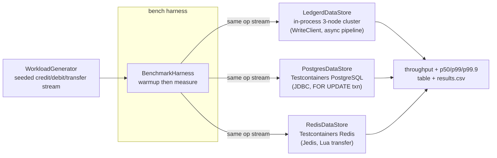

# 0013 - Datastore Benchmark Methodology

Status: Accepted
Date: 2026-08-06

## Context

The roadmap (month 0-3 and 3-6, build-in-public) calls for a public benchmark of
LEDGERD against the datastores a team would otherwise reach for to hold wallet
balances: a relational database (PostgreSQL) and an in-memory key-value store
(Redis). The goal is a credible, reproducible story - "a deterministic,
allocation-free ledger that is competitive on throughput and far tighter on tail
latency" - not a marketing leaderboard.

A benchmark like this is easy to get wrong and easy to distrust. The three systems
sit at different points on the durability / consistency / topology spectrum, so a
single "ops per second" number compared naively is misleading. This ADR fixes the
methodology, the workload, and - just as importantly - the caveats, so the numbers
mean exactly what they claim and can be regenerated by anyone with Docker.

## Decision

A new Edge module `bench` runs one identical logical workload against each
backend behind a common `DataStore` interface and reports throughput and latency
percentiles side by side.

1. **Bounded context: Edge, not core.** `bench` is illustrative
   infrastructure like `examples`. It may use the system clock, heap
   allocation, `HashMap`, streams, threads, and blocking JDBC/Redis clients. It
   MUST NOT link the deterministic core hot path. Its code is exempt from the core
   determinism rules but still formats and lints clean (spotless, checkstyle);
   `-Werror` is relaxed as for `examples`, since third-party client APIs emit
   unavoidable lint.

2. **One workload, replayed identically.** `WorkloadGenerator` produces a seeded
   pseudo-random op stream (`CREDIT` / `DEBIT` / `TRANSFER`) over `N` accounts with
   a configurable mix (default 40/30/30). The same seed yields the same stream for
   every backend, so all three execute the exact same sequence. Amounts are small
   relative to a large seeded initial balance, so no debit or transfer underflows;
   every op succeeds on every backend and the final total supply is a pure function
   of the stream (used as a cross-backend correctness check).

3. **Backends.**
   - **LEDGERD:** an in-process three-node Aeron cluster driven by `WriteClient`. This
     includes the full Raft replication and Archive-durability cost, so the number
     reflects the replicated, durable ledger - not a single-process shortcut. It is
     overridable to an external cluster via `LEDGERD_INGRESS_ENDPOINTS`.
   - **PostgreSQL:** one row per account. Credit/debit are single `UPDATE`s;
     transfer is a transaction that locks both rows with `SELECT ... FOR UPDATE` in
     ascending id order (deadlock-free) then updates and commits. Each op pays a WAL
     fsync at the default `synchronous_commit=on`.
   - **Redis:** each account is an integer counter. Credit/debit are
     `INCRBY`/`DECRBY`; transfer is a single atomic Lua script. In-memory, no
     durability enabled by default.

4. **Concurrency parity.** A single `concurrency` knob is applied uniformly: it is
   LEDGERD's `maxInFlight` async pipeline depth and the fixed worker-thread (and
   connection) count for Postgres and Redis. This holds the number of concurrent
   in-flight operations roughly equal; the harness documents that LEDGERD's model is
   pipelined-async while Postgres/Redis are thread-per-op.

5. **Measurement.** For each backend: create accounts, run a warmup window
   (discarded), reset the latency histogram, then run the measured window while
   wall-clock timing it. Throughput is measured ops over elapsed wall time.
   Latency is end-to-end per op via HdrHistogram: for LEDGERD, `WriteClient`'s
   submit-to-result histogram; for Postgres/Redis, wall-clock around each blocking
   call, recorded into per-worker histograms merged at the end. Reported
   percentiles: p50, p99, p99.9, and max.

6. **Provisioning and reproducibility.** Postgres and Redis are started on demand
   via Testcontainers, so a run is a single command and needs only a reachable
   Docker daemon (the harness fails fast with a clear message otherwise). Seeds,
   account counts, and window sizes are explicit arguments. Results are printed as
   a table and written to `build/bench/results.csv`.

## Consequences

- The result is **directional, not a leaderboard**. The three systems differ in
  ways that matter more than the raw number:
  - **Durability:** LEDGERD replicates via Raft and records to an Archive; Postgres
    fsyncs WAL per commit; Redis is in-memory with no durability by default. Redis
    will look fastest partly because it promises the least. This is stated wherever
    the numbers appear.
  - **Topology:** LEDGERD runs three replicas (real consensus); Postgres and Redis run
    as a single node. LEDGERD is therefore doing strictly more work for the same op.
  - **Execution model:** LEDGERD is pipelined-async over one connection; Postgres and
    Redis are synchronous thread-per-op. Parity is on in-flight concurrency, not on
    the model itself.
- The benchmark is **not** part of the CI gate. It requires Docker and is
  wall-clock sensitive; it is run on demand for publication, unlike the JMH
  micro-benchmarks, which stay in `core` / `read` and continue to gate
  the hot path. Migrating the JMH suites into this module was explicitly declined
  to keep the CI budget check untouched.
- A **durability-matched** configuration (Redis AOF `everysec`, Postgres tuning) is
  a natural follow-up to make the comparison fairer on Redis's terms. It is out of
  scope for the first cut, which runs each store at its defaults and documents the
  asymmetry rather than hiding it.
- The headline for the write-up is **tail latency**, consistent with the project's
  budget philosophy (p99.9 is the contract, not the mean): the interesting claim is
  variance, not average throughput.

## Testing

- The harness self-checks correctness per backend: after the run, Postgres and
  Redis assert their total supply equals the value derived from the op stream, and
  LEDGERD asserts every submitted command completed with none dropped. A divergence
  fails the run rather than reporting a meaningless number.
- Reproducibility is validated by re-running with a fixed seed and confirming the
  same op stream and the same correctness invariant.
