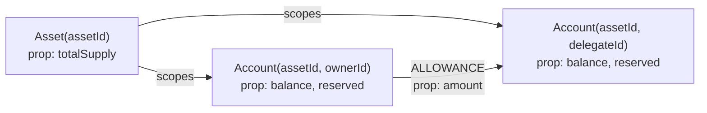
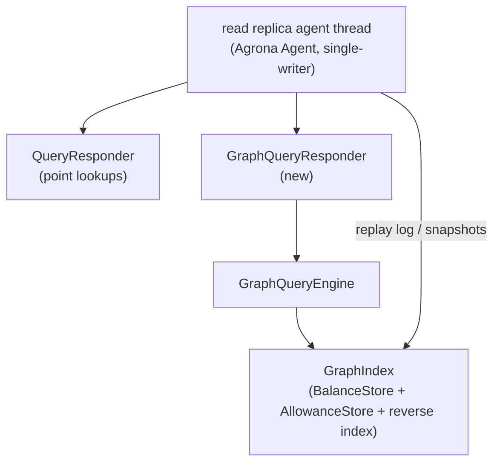

# Graph Query Engine - Design

Companion design for ADR 0013. This document specifies the read-side
`GraphQueryEngine`: the query model, the executor, the risk views, and the wire
protocol. It is the implementation guide; ADR 0013 is the decision record.

## 1. Goals and non-goals

**Goals**

- Answer general graph queries (pattern match, filter, projection, aggregation,
  ordering) over the replicated ledger state.
- Provide risk-analysis views (blast radius, concentration, cycles, dormant
  authority) on the same traversal primitives.
- Keep the deterministic `core` module, the consensus log, and the snapshot
  format unchanged.
- Bound every query in time and memory so it cannot stall replication or the
  point-lookup path.

**Non-goals (first cut)**

- `TRANSFER` edges and time-based risk (velocity, volume). Deferred to wiring the
  domain event journal (ADR 0011) into the graph.
- A text query language. The structured query model is canonical; a text
  language can later compile into it.
- Strong or linearizable reads (ADR 0005 keeps the eventually-consistent
  contract).

## 2. Derived graph model

The graph is a query-time view over the existing projections. No new store is
materialized.



- **Node `Account(assetId, accountId)`** - properties `balance` (available),
  `reserved`, `exists`. Sourced from `BalanceStore`.
- **Node `Asset(assetId)`** - property `totalSupply`. Sourced from
  `BalanceStore.forEachSupplySorted`.
- **Edge `ALLOWANCE(owner -> delegate, assetId)`** - property `amount`. Sourced
  from `AllowanceStore`.

Nodes and edges are never materialized as objects in steady state. The executor
reads `long` ids and values directly from the stores via the traversal
primitives in section 4.2.

## 3. Placement, threading, allocation



- The engine runs on the read replica's single agent thread, the same thread
  that drives `ReadReplicaNode` and `QueryResponder`. No synchronization, no
  atomics.
- The query path is a cold read path, not the consensus hot path. Allocation is
  allowed but bounded: result builders, binding arenas, and sort scratch are
  preallocated to configured capacities and reused. The engine never allocates
  per row in the inner expansion loop (ids and amounts are `long`).
- Variable names are interned to `int` slots at query build time; the executor
  binds into a `long[]` indexed by variable slot, so the inner loop does no
  string hashing.

## 4. Query model

### 4.1 Canonical model (value types)

```java
// Shared by read-client and read. Immutable after build.
public final class GraphQuery {
    Pattern[] patterns;        // one or more MATCH patterns, applied in order
    boolean[] optional;        // optional[i] = true -> OPTIONAL MATCH
    Condition where;           // nullable boolean expression over bound variables
    ReturnItem[] returns;      // projection (at least one)
    OrderKey[] orderBy;        // nullable; up to 8 keys
    int skip;
    int limit;                 // 0 = engine default
}

public final class Pattern {
    NodePattern start;         // first node
    Step[] steps;              // alternating edge + node, zero or more
}

public final class Step {
    EdgePattern edge;
    NodePattern node;
}

public final class NodePattern {
    NodeKind kind;             // ACCOUNT or ASSET
    int variable;              // -1 = anonymous
    PropFilter[] props;        // e.g. balance >= 0
}

public final class EdgePattern {
    EdgeKind kind;             // ALLOWANCE
    Direction direction;       // OUT, IN, ANY
    int variable;              // -1 = anonymous
    int minHops;               // 1 for fixed length
    int maxHops;               // minHops for fixed, 0 = unbounded (capped)
    PropFilter[] props;        // e.g. amount >= 1000
}

// Property filter leaf: var.prop OP literal. Ops: EQ, NEQ, LT, LTE, GT, GTE.
public final class PropFilter {
    int variable;
    Property property;         // BALANCE, RESERVED, AMOUNT, TOTAL_SUPPLY, ID, ASSET
    Op op;
    long literal;
}

// Boolean expression tree (matches cbm_expr_t).
public sealed interface Condition { }
public record CondLeaf(PropFilter filter, boolean negated) implements Condition { }
public record CondAnd(Condition l, Condition r) implements Condition { }
public record CondOr(Condition l, Condition r) implements Condition { }
public record CondNot(Condition c) implements Condition { }
public record CondExists(EdgePattern edge, int anchor) implements Condition { }

public final class ReturnItem {
    int variable;              // -1 for aggregate-only
    Property property;         // null for whole node (id)
    Aggregate aggregate;       // null, COUNT, SUM, MIN, MAX
    boolean distinct;
    String alias;              // column name
}

public enum ValueKind { LONG, STRING }
```

`Property` is a fixed enum (`ID`, `ASSET`, `BALANCE`, `RESERVED`,
`TOTAL_SUPPLY`, `AMOUNT`), not an open string set. This keeps the executor's
property resolution a `switch` on a small ordinal, not a string lookup, and it
matches the existing SBE style of closed enums. A query that needs a property
outside this set is rejected at build time with `UNSUPPORTED`.

### 4.2 Traversal primitives (`GraphIndex`)

The executor depends on a `GraphIndex` interface, not on the stores directly.
The read replica adapts `BalanceStore` + `AllowanceStore` + a reverse index to
it.

```java
public interface GraphIndex {
    // Node scans. Callbacks receive primitive values; no per-node allocation.
    void forEachAccount(long assetId, AccountVisitor v);   // assetId < 0 = all assets
    void forEachAsset(AssetVisitor v);

    // Edge adjacency. minHops/maxHops handled by the executor, not the index.
    void forEachOutAllowance(long assetId, long ownerId, AllowanceVisitor v);
    void forEachInAllowance(long assetId, long delegateId, AllowanceVisitor v);

    // Reverse index lifetime: valid until appliedPosition advances.
    long appliedPosition();
}

interface AccountVisitor { void accept(long assetId, long accountId, long balance, long reserved); }
interface AssetVisitor   { void accept(long assetId, long totalSupply); }
interface AllowanceVisitor { void accept(long assetId, long ownerId, long delegateId, long amount); }
```

New store capabilities required (both additive, neither on the consensus hot
path):

1. `AllowanceStore.forEachDelegate(assetId, ownerId, visitor)` - forward
   iteration. Additive accessor over the existing nested maps.
2. `AllowanceReverseIndex` in `read` - `delegate -> owners` built from
   `AllowanceStore.forEachSorted`, cached, and invalidated whenever
   `appliedPosition` advances. It is rebuilt lazily on first inbound use after
   an invalidation, so idle replicas pay nothing.

## 5. Executor

The executor mirrors the binding-expansion executor of `codebase-memory-mcp`
(`expand_pattern_rels`, `expand_fixed_length`, `expand_var_length`). There is no
cost-based planner; patterns are expanded left to right, and node/edge
selectivity is exploited by filtering as early as possible.

### 5.1 Binding expansion

A **binding** is a `long[]` indexed by variable slot plus a `byte[]` kind mask
(`UNBOUND`, `ACCOUNT`, `ASSET`, `EDGE`). Edge values (amount) live in a parallel
`long[]` edge slot. Bindings grow in a preallocated arena and are released back
to it when a row is projected or rejected, so the expansion loop does not
allocate.

```text
execute(query, maxRows, deadlineNanos):
    bindings = [ empty binding ]
    for i in 0..patterns.length-1:
        bindings = expandPattern(index, patterns[i], bindings, deadlineNanos)
        if optional[i]:
            keep rows that found no match, with the pattern's vars left UNBOUND
    for b in bindings:
        if where != null and not eval(where, b): continue
        project(b) into result rows
    aggregate if any ReturnItem has a non-null aggregate
    order, skip, limit, distinct
    return result

expandPattern(index, pattern, inBindings, deadline):
    out = []
    for b in inBindings:
        for start in matchNodes(index, pattern.start, b):
            b2 = b.bind(pattern.start.variable, start)
            expandSteps(index, pattern.steps, 0, b2, out, deadline)
    return out

expandSteps(index, steps, i, b, out, deadline):
    checkDeadline(deadline)
    if i == steps.length: out.add(b); return
    step = steps[i]
    for (edge, node) in matchEdges(index, step, b, deadline):
        b2 = b.bind(step.edge.variable, edge).bind(step.node.variable, node)
        expandSteps(index, steps, i+1, b2, out, deadline)
```

### 5.2 Node matching

- If `pattern.start.variable` is already bound in `b`, the start node is the
  bound value; the pattern acts as a filter (kind and property predicates must
  hold), never as a re-scan. This is the `process_edges` bound-terminal rule of
  `codebase-memory-mcp`, and it is what makes `(a)-[:ALLOWANCE]->(b)` followed by
  `(c)-[:ALLOWANCE]->(b)` filter instead of cross-join.
- Otherwise the node is scanned with `forEachAccount` / `forEachAsset`, filtered
  by `kind` and `props` as the values stream.

### 5.3 Edge matching

- **Fixed length** (`minHops == maxHops == 1`): call `forEachOutAllowance` or
  `forEachInAllowance` (or both for `ANY`), filter by `props`, bind the far node.
  The far node is resolved by id and its own `NodePattern` predicates applied.
- **Variable length** (`maxHops > minHops`, or `maxHops == 0` for unbounded):
  bounded BFS over the adjacency, with `maxHops` clamped to the engine depth cap
  (default 8). The clamp is recorded as a result warning, never silent, matching
  `codebase-memory-mcp`'s `g_cypher_depth_clamped` behavior.

### 5.4 Where evaluation

`eval(where, b)` walks the `Condition` tree. `CondLeaf` resolves the bound
variable's property and applies the operator against the literal. `CondExists`
checks a single-hop edge existence from the anchor variable (used for
dormant-allowance queries: `NOT EXISTS` an inbound edge with a non-zero amount).

### 5.5 Aggregation and projection

- If no `ReturnItem` carries an aggregate, projection is a straight column
  build.
- If any item aggregates, rows are grouped by the non-aggregate items and
  `COUNT` / `SUM` / `MIN` / `MAX` are applied per group. `COUNT(DISTINCT x)` is
  supported for id columns via a small dedup set reused across groups.

### 5.6 Result representation

```java
public final class QueryResult implements AutoCloseable {
    int columnCount();
    String columnName(int col);
    ValueKind columnKind(int col);
    int rowCount();
    long longAt(int row, int col);        // LONG columns
    String stringAt(int row, int col);    // STRING columns (node kind / edge kind)
    boolean truncated();                  // row ceiling hit
    String warning();                     // depth clamp, etc. (nullable)
}
```

LONG columns are stored flat in `long[]` (no boxing). STRING columns exist only
for node/edge kind projections and reuse a small interned table, so results stay
compact and SBE-encodable.

## 6. Risk analysis views

Each view is a precompiled `GraphQuery` (or a small dedicated traversal) exposed
as its own `QueryType`, mirroring the dedicated tools of `codebase-memory-mcp`
rather than forcing clients to hand-write the underlying query.

| View | Definition | `codebase-memory-mcp` analog |
|---|---|---|
| `trace_allowance(assetId, accountId, direction, maxDepth)` | BFS over `ALLOWANCE`; returns reachable accounts with hop and risk label. Risk = hop: 1 = CRITICAL, 2 = HIGH, 3 = MEDIUM, 4+ = LOW. | `trace_path` + `risk_labels` via `cbm_hop_to_risk` |
| `hotspots(assetId, limit)` | Top-N accounts by fan-in (distinct owners delegating to them). Concentration / choke points. | `arch_hotspots` (`COUNT(*) fan_in ... ORDER BY fan_in DESC LIMIT 10`) |
| `reachability(assetId, from, to, maxHops)` | Whether a directed path exists in the allowance graph. | variable-length `MATCH` |
| `delegation_cycles(assetId, maxDepth)` | Accounts on any cycle `a -> ... -> a`. | `recursive` flag in `pass_complexity` |
| `dormant_allowances(assetId)` | `(owner, delegate, amount)` where the owner's available balance is zero. Authority without backing funds. | dead-code `WHERE NOT EXISTS { (f)<-[:CALLS]-() }` |
| `concentration(assetId, thresholdPct)` | Accounts whose balance is at or above a fraction of `totalSupply`. | aggregate over node properties |

Blast-radius semantics note: an `ALLOWANCE` edge is not spend-transitive. A
delegate can only spend what its owner granted; it cannot spend what the owner's
own delegates were granted. `trace_allowance` therefore reports *reachability in
the authority graph* (who is within N hops of authority over the seed's funds),
not a mechanical sum of spendable amounts. Consumers of the CRITICAL/HIGH/MEDIUM
labels must treat the label as proximity, not as a proven spend path.

## 7. Wire protocol and read-client

Additive to the existing query protocol (ADR 0005, `QueryRequest`/`QueryResponse`).

- **`GraphQueryRequest`** (new template, schema version bump): `requestId`,
  `assetId` scope (sentinel for all assets), `maxRows`, `maxDepth`, the response
  channel/stream for the reply, and a varData `query` carrying the canonical
  `GraphQuery` encoding. The encoding is a direct SBE mirror of section 4.1, not
  free text, so the read replica never parses user text.
- **`GraphQueryResponse`**: `requestId`, `status` (`SUCCESS`, `TRUNCATED`,
  `TIMEOUT`, `UNSUPPORTED`, `NOT_FOUND`), `appliedPosition`, a `columns` group
  (name + `ValueKind`), and a `rows` group (each row is a group of typed cells
  encoded as `int64` for LONG and varData for STRING). A `warning` varData
  carries the depth-clamp or truncation notice.
- **`read-client`** gains `GraphQueryClient` and a fluent `GraphQueryBuilder`
  that compiles into `GraphQuery` and submits it with correlation and idempotent
  retry, matching the existing `QueryClient` surface. The builder is the
  ergonomic boundary; the model is the wire contract.

The existing four point-lookup query types are unchanged. The
`GraphQueryResponder` is a sibling of `QueryResponder`, polled from the same
agent thread, reusing the response-publication LRU pattern.

## 8. Safety and limits

All are enforced in the executor, not at the boundary:

- **Wall-clock budget.** A per-query deadline (default 10 ms) checked in
  `expandSteps` and in the BFS loop. Exceeded -> `TIMEOUT`, no partial rows.
- **Row ceiling.** Default 10 000 materialized rows. Exceeded -> `TRUNCATED`
  plus the rows already produced; the flag is explicit, never silent.
- **Depth cap.** Variable-length expansion clamped to 8 hops (configurable).
  Clamped -> `warning` in the result, so a clamp is distinguishable from
  "no such path".
- **Fail-closed.** An unknown property, unsupported aggregate, or a query shape
  outside section 4 is rejected at build/decode time with `UNSUPPORTED`, never
  answered with an empty result.
- **Single-writer.** The engine is only ever entered from the agent thread, so a
  long-running query would delay replication. The wall-clock budget is therefore
  a hard correctness property of the read replica, not a tuning knob.

## 9. Phased rollout

1. **Phase 1 (this design).** `GraphIndex` over existing stores +
   `AllowanceReverseIndex`; the executor for fixed-length `ALLOWANCE` patterns,
   filters, projection, `COUNT`/`SUM`/`MIN`/`MAX`, ordering, and limits; the six
   risk views; `GraphQueryRequest`/`GraphQueryResponse`; `read-client` builder.
2. **Phase 2.** Variable-length BFS and `CondExists` (already specified here but
   exercisable independently), plus `delegation_cycles`.
3. **Phase 3.** Wire the domain event journal (ADR 0011) to expose `TRANSFER`
   edges and time-based risk (velocity, recently-active, transfer fan-out).
4. **Phase 4 (optional).** A text Cypher-like language compiled to `GraphQuery`
   in `read-client`, not on the read replica.
